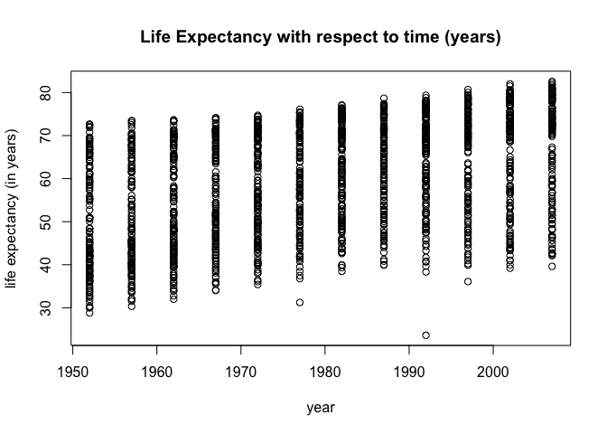
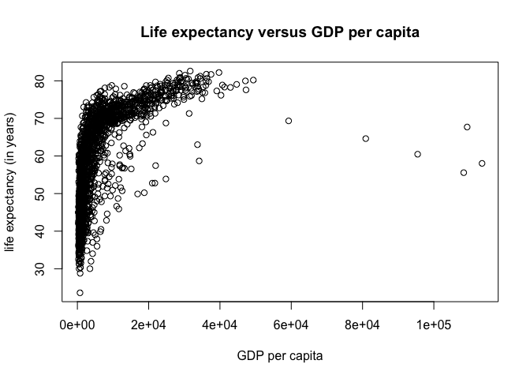
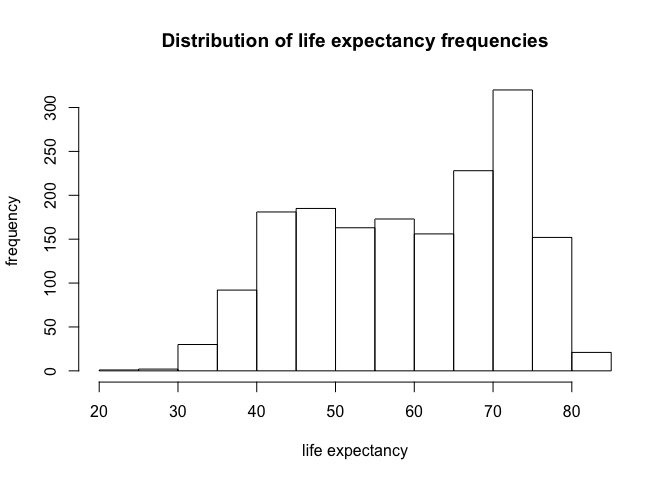
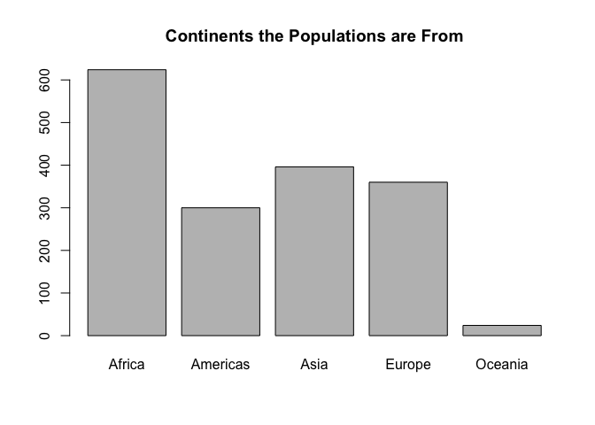
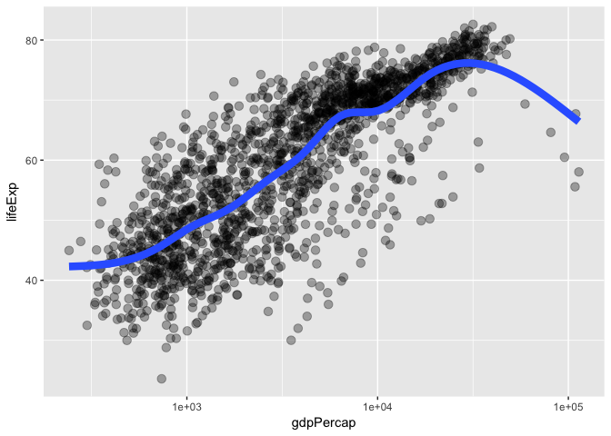

Exploration of gapminder
================
Lisa Wei
2017-09-14

Loading the gapminder dataset and basic summary of the data.
------------------------------------------------------------

``` r
library(gapminder) ### contains a dataset
library(tidyverse) ### automatically loads in ggplot2

#gapminder 
#head(gapminder)
#glimpse(gapminder)
#tail(gapminder)
summary(gapminder); 
```

    ##         country        continent        year         lifeExp     
    ##  Afghanistan:  12   Africa  :624   Min.   :1952   Min.   :23.60  
    ##  Albania    :  12   Americas:300   1st Qu.:1966   1st Qu.:48.20  
    ##  Algeria    :  12   Asia    :396   Median :1980   Median :60.71  
    ##  Angola     :  12   Europe  :360   Mean   :1980   Mean   :59.47  
    ##  Argentina  :  12   Oceania : 24   3rd Qu.:1993   3rd Qu.:70.85  
    ##  Australia  :  12                  Max.   :2007   Max.   :82.60  
    ##  (Other)    :1632                                                
    ##       pop              gdpPercap       
    ##  Min.   :6.001e+04   Min.   :   241.2  
    ##  1st Qu.:2.794e+06   1st Qu.:  1202.1  
    ##  Median :7.024e+06   Median :  3531.8  
    ##  Mean   :2.960e+07   Mean   :  7215.3  
    ##  3rd Qu.:1.959e+07   3rd Qu.:  9325.5  
    ##  Max.   :1.319e+09   Max.   :113523.1  
    ## 

``` r
#str(gapminder)
dim(gapminder)
```

    ## [1] 1704    6

``` r
class(gapminder)
```

    ## [1] "tbl_df"     "tbl"        "data.frame"

Some basic plotting
-------------------

Please note that year ranges from 1952 to 2007 in increments of 5 years as stated in R Doumentation. Life expectancy calculated from birth, in years. I obtained this information by typing in ?gapminder in RStudio.

``` r
plot(lifeExp ~ year, gapminder, xlab="year", ylab="life expectancy (in years)", main="Life Expectancy with respect to time (years)")
```



The plot below shows how life expectancy is related to GDP per capita.

``` r
plot(lifeExp ~ gdpPercap, gapminder, xlab="GDP per capita", ylab="life expectancy (in years)", main="Life expectancy versus GDP per capita")
```



Here is the same plot as the one immediately above, but GDP per capita is put on a log scale to better see the increasing trend at the start of the year axis.

``` r
plot(lifeExp ~ log(gdpPercap), gapminder, xlab="log(GDP per capita)", ylab="life expectancy (in years)", main="Life expectancy versus log(GDP per capita)")
```

-1.png)

Looking closer at the distribution in life expectancy.

``` r
summary(gapminder$lifeExp)
```

    ##    Min. 1st Qu.  Median    Mean 3rd Qu.    Max. 
    ##   23.60   48.20   60.71   59.47   70.85   82.60

``` r
##    Min. 1st Qu.  Median    Mean 3rd Qu.    Max. 
##   23.60   48.20   60.71   59.47   70.85   82.60
hist(gapminder$lifeExp, xlab="life expectancy", ylab="frequency", main="Distribution of life expectancy frequencies")
```



Look at demographics.
---------------------

``` r
table(gapminder$continent)
```

    ## 
    ##   Africa Americas     Asia   Europe  Oceania 
    ##      624      300      396      360       24

``` r
barplot(table(gapminder$continent), main="Continents the Populations are From")
```



A nicer rendering of plots using ggplot2
----------------------------------------

``` r
p <- ggplot(filter(gapminder, continent != "Oceania"),
            aes(x = gdpPercap, y = lifeExp)) # just initializes
p <- p + scale_x_log10() # log the x axis the right way
p + geom_point() # scatterplot
```


``` r
p + geom_point(aes(color = continent)) # map continent to color
```


``` r
p + geom_point(alpha = (1/3), size = 3) + geom_smooth(lwd = 3, se = FALSE)
```



``` r
p + geom_point(alpha = (1/3), size = 3) + facet_wrap(~ continent) +
  geom_smooth(lwd = 1.5, se = FALSE)
```


### Student Reflection of Github Workflow

Since I have worked with markdown files and Github in a previous UBC course (STAT545), I was familiar with the general workflow.

Some new things I learned while doing this homework assignment:

1.  If I have made changes locally, I need to push everything to Github first before I pull all files from Github to my local computer.

2.  When I need to delete a file, I usually do it on Github rather than remotely since I found it screws up the pushing and pulling. I tried to delete and rename files remotely and pulling, but there were errors that came up. So I ended up having to start a completely new project. For most of the time, especially for the gapminder\_hw01.Rmd file and README.md, I editted locally, saved, commited and pushed to Github. Each time I made sure to add comments when I made the commit to describe what changes were made.
