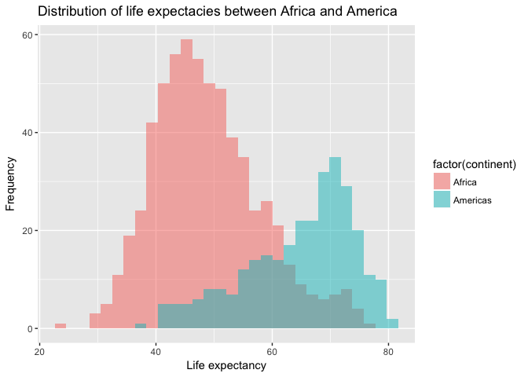

Explore Gapminder with dplyr and ggplot2
================
Lisa Wei
2017-09-23

This is an exploration of the Gapminder dataset using tools and functions from the dplyr package.

Bring rectangular data in
-------------------------

``` r
## load the gapminder package
#install.packages("gapminder")
library(gapminder)
## load the tidyverse package (containing dplyr)
library(tidyverse)

#load other useful packages
library(ggExtra)
library(knitr)
library(kableExtra)
```

### "Smell" test the data

Q1.1: Is it a data.frame, a matrix, a vector, a list? A: Gapminder is a tibble, data.frame, and a list.

``` r
class(gapminder)
```

    ## [1] "tbl_df"     "tbl"        "data.frame"

Q1.2: What’s its class? A: Gapminder is a list as indicated by `typeof()`. But it is also a tibble and data frame if one uses `class()`.

``` r
typeof(gapminder)
```

    ## [1] "list"

Q1.3: How many rows/observations? A: Number of rows:

``` r
nrow(gapminder); 
```

    ## [1] 1704

Q1.4: How many columns/variables? A: number of columns

``` r
ncol(gapminder)
```

    ## [1] 6

Double check with dim() showing dimensions of the data

``` r
dim(gapminder); 
```

    ## [1] 1704    6

Q1.5: Can you get these facts about “extent” or “size” in more than one way? Can you imagine different functions being useful in different contexts?

A: Can just type in gapminder to get a sneak peak of the data as well as the dimensions. Also, other functions that could be useful is using `str()` which shows the overall dimension and type of the dataset and the type of each variable/column. The `str()` function is very useful is one wants a quick way to access the class of each variable in order to do operations on certain columns.

``` r
gapminder
```

    ## # A tibble: 1,704 x 6
    ##        country continent  year lifeExp      pop gdpPercap
    ##         <fctr>    <fctr> <int>   <dbl>    <int>     <dbl>
    ##  1 Afghanistan      Asia  1952  28.801  8425333  779.4453
    ##  2 Afghanistan      Asia  1957  30.332  9240934  820.8530
    ##  3 Afghanistan      Asia  1962  31.997 10267083  853.1007
    ##  4 Afghanistan      Asia  1967  34.020 11537966  836.1971
    ##  5 Afghanistan      Asia  1972  36.088 13079460  739.9811
    ##  6 Afghanistan      Asia  1977  38.438 14880372  786.1134
    ##  7 Afghanistan      Asia  1982  39.854 12881816  978.0114
    ##  8 Afghanistan      Asia  1987  40.822 13867957  852.3959
    ##  9 Afghanistan      Asia  1992  41.674 16317921  649.3414
    ## 10 Afghanistan      Asia  1997  41.763 22227415  635.3414
    ## # ... with 1,694 more rows

``` r
str(gapminder)
```

    ## Classes 'tbl_df', 'tbl' and 'data.frame':    1704 obs. of  6 variables:
    ##  $ country  : Factor w/ 142 levels "Afghanistan",..: 1 1 1 1 1 1 1 1 1 1 ...
    ##  $ continent: Factor w/ 5 levels "Africa","Americas",..: 3 3 3 3 3 3 3 3 3 3 ...
    ##  $ year     : int  1952 1957 1962 1967 1972 1977 1982 1987 1992 1997 ...
    ##  $ lifeExp  : num  28.8 30.3 32 34 36.1 ...
    ##  $ pop      : int  8425333 9240934 10267083 11537966 13079460 14880372 12881816 13867957 16317921 22227415 ...
    ##  $ gdpPercap: num  779 821 853 836 740 ...

Q1.6: What data type is each variable? A: Can be answered with `str()` as seen above:

-   Country is factor
-   Continent is factor
-   Year is integer
-   LifeExp is number
-   Pop is integer

Can also check the data type of each variable one by one:

``` r
class(gapminder$country) 
```

    ## [1] "factor"

``` r
class(gapminder$continent)
```

    ## [1] "factor"

``` r
class(gapminder$year)
```

    ## [1] "integer"

``` r
class(gapminder$lifeExp)
```

    ## [1] "numeric"

``` r
class(gapminder$pop)
```

    ## [1] "integer"

``` r
class(gapminder$gdpPercap)
```

    ## [1] "numeric"

Explore individual variables
----------------------------

Explore categorical variables `continent` and `country`. Explore quantitative variables `population` and `lifeExp`.

Q2.1 What are possible values (or range, whichever is appropriate) of each variable?

A: For continent and country, since they categorical, below are all possible values for each variable. There are in total 142 distinct countries and 5 distinct continents in the gapminder dataset.

``` r
unique(gapminder$continent)
```

    ## [1] Asia     Europe   Africa   Americas Oceania 
    ## Levels: Africa Americas Asia Europe Oceania

``` r
unique(gapminder$country)
```

    ##   [1] Afghanistan              Albania                 
    ##   [3] Algeria                  Angola                  
    ##   [5] Argentina                Australia               
    ##   [7] Austria                  Bahrain                 
    ##   [9] Bangladesh               Belgium                 
    ##  [11] Benin                    Bolivia                 
    ##  [13] Bosnia and Herzegovina   Botswana                
    ##  [15] Brazil                   Bulgaria                
    ##  [17] Burkina Faso             Burundi                 
    ##  [19] Cambodia                 Cameroon                
    ##  [21] Canada                   Central African Republic
    ##  [23] Chad                     Chile                   
    ##  [25] China                    Colombia                
    ##  [27] Comoros                  Congo, Dem. Rep.        
    ##  [29] Congo, Rep.              Costa Rica              
    ##  [31] Cote d'Ivoire            Croatia                 
    ##  [33] Cuba                     Czech Republic          
    ##  [35] Denmark                  Djibouti                
    ##  [37] Dominican Republic       Ecuador                 
    ##  [39] Egypt                    El Salvador             
    ##  [41] Equatorial Guinea        Eritrea                 
    ##  [43] Ethiopia                 Finland                 
    ##  [45] France                   Gabon                   
    ##  [47] Gambia                   Germany                 
    ##  [49] Ghana                    Greece                  
    ##  [51] Guatemala                Guinea                  
    ##  [53] Guinea-Bissau            Haiti                   
    ##  [55] Honduras                 Hong Kong, China        
    ##  [57] Hungary                  Iceland                 
    ##  [59] India                    Indonesia               
    ##  [61] Iran                     Iraq                    
    ##  [63] Ireland                  Israel                  
    ##  [65] Italy                    Jamaica                 
    ##  [67] Japan                    Jordan                  
    ##  [69] Kenya                    Korea, Dem. Rep.        
    ##  [71] Korea, Rep.              Kuwait                  
    ##  [73] Lebanon                  Lesotho                 
    ##  [75] Liberia                  Libya                   
    ##  [77] Madagascar               Malawi                  
    ##  [79] Malaysia                 Mali                    
    ##  [81] Mauritania               Mauritius               
    ##  [83] Mexico                   Mongolia                
    ##  [85] Montenegro               Morocco                 
    ##  [87] Mozambique               Myanmar                 
    ##  [89] Namibia                  Nepal                   
    ##  [91] Netherlands              New Zealand             
    ##  [93] Nicaragua                Niger                   
    ##  [95] Nigeria                  Norway                  
    ##  [97] Oman                     Pakistan                
    ##  [99] Panama                   Paraguay                
    ## [101] Peru                     Philippines             
    ## [103] Poland                   Portugal                
    ## [105] Puerto Rico              Reunion                 
    ## [107] Romania                  Rwanda                  
    ## [109] Sao Tome and Principe    Saudi Arabia            
    ## [111] Senegal                  Serbia                  
    ## [113] Sierra Leone             Singapore               
    ## [115] Slovak Republic          Slovenia                
    ## [117] Somalia                  South Africa            
    ## [119] Spain                    Sri Lanka               
    ## [121] Sudan                    Swaziland               
    ## [123] Sweden                   Switzerland             
    ## [125] Syria                    Taiwan                  
    ## [127] Tanzania                 Thailand                
    ## [129] Togo                     Trinidad and Tobago     
    ## [131] Tunisia                  Turkey                  
    ## [133] Uganda                   United Kingdom          
    ## [135] United States            Uruguay                 
    ## [137] Venezuela                Vietnam                 
    ## [139] West Bank and Gaza       Yemen, Rep.             
    ## [141] Zambia                   Zimbabwe                
    ## 142 Levels: Afghanistan Albania Algeria Angola Argentina ... Zimbabwe

``` r
n_distinct(gapminder$continent)
```

    ## [1] 5

``` r
n_distinct(gapminder$country)
```

    ## [1] 142

For population and lifeExp, since they are quantitative, let's explore the the range. As seen below, the range of pop is 60011 to 1318683096. The range of lifeExp is 23.599 to 82.603.

``` r
range(gapminder$pop)
```

    ## [1]      60011 1318683096

``` r
range(gapminder$lifeExp)
```

    ## [1] 23.599 82.603

``` r
# can also check with min and max
min(gapminder$pop)
```

    ## [1] 60011

``` r
max(gapminder$pop)
```

    ## [1] 1318683096

``` r
min(gapminder$lifeExp)
```

    ## [1] 23.599

``` r
max(gapminder$lifeExp)
```

    ## [1] 82.603

Q2.2: What values are typical? What's the spread? What's the distribution?

A: For continent, Africa shows up with the highest frequency. For country, all countries show up at equal frequency of 12 times. Since all countries have the same frequency, I will only plot a bar graph for continent.

``` r
summary(gapminder)
```

    ##         country        continent        year         lifeExp     
    ##  Afghanistan:  12   Africa  :624   Min.   :1952   Min.   :23.60  
    ##  Albania    :  12   Americas:300   1st Qu.:1966   1st Qu.:48.20  
    ##  Algeria    :  12   Asia    :396   Median :1980   Median :60.71  
    ##  Angola     :  12   Europe  :360   Mean   :1980   Mean   :59.47  
    ##  Argentina  :  12   Oceania : 24   3rd Qu.:1993   3rd Qu.:70.85  
    ##  Australia  :  12                  Max.   :2007   Max.   :82.60  
    ##  (Other)    :1632                                                
    ##       pop              gdpPercap       
    ##  Min.   :6.001e+04   Min.   :   241.2  
    ##  1st Qu.:2.794e+06   1st Qu.:  1202.1  
    ##  Median :7.024e+06   Median :  3531.8  
    ##  Mean   :2.960e+07   Mean   :  7215.3  
    ##  3rd Qu.:1.959e+07   3rd Qu.:  9325.5  
    ##  Max.   :1.319e+09   Max.   :113523.1  
    ## 

``` r
## sorting from highest to lowest frequency for continents and countries
sort(table(gapminder$continent), decreasing=TRUE)
```

    ## 
    ##   Africa     Asia   Europe Americas  Oceania 
    ##      624      396      360      300       24

``` r
sort(table(gapminder$country), decreasing=TRUE)
```

    ## 
    ##              Afghanistan                  Albania                  Algeria 
    ##                       12                       12                       12 
    ##                   Angola                Argentina                Australia 
    ##                       12                       12                       12 
    ##                  Austria                  Bahrain               Bangladesh 
    ##                       12                       12                       12 
    ##                  Belgium                    Benin                  Bolivia 
    ##                       12                       12                       12 
    ##   Bosnia and Herzegovina                 Botswana                   Brazil 
    ##                       12                       12                       12 
    ##                 Bulgaria             Burkina Faso                  Burundi 
    ##                       12                       12                       12 
    ##                 Cambodia                 Cameroon                   Canada 
    ##                       12                       12                       12 
    ## Central African Republic                     Chad                    Chile 
    ##                       12                       12                       12 
    ##                    China                 Colombia                  Comoros 
    ##                       12                       12                       12 
    ##         Congo, Dem. Rep.              Congo, Rep.               Costa Rica 
    ##                       12                       12                       12 
    ##            Cote d'Ivoire                  Croatia                     Cuba 
    ##                       12                       12                       12 
    ##           Czech Republic                  Denmark                 Djibouti 
    ##                       12                       12                       12 
    ##       Dominican Republic                  Ecuador                    Egypt 
    ##                       12                       12                       12 
    ##              El Salvador        Equatorial Guinea                  Eritrea 
    ##                       12                       12                       12 
    ##                 Ethiopia                  Finland                   France 
    ##                       12                       12                       12 
    ##                    Gabon                   Gambia                  Germany 
    ##                       12                       12                       12 
    ##                    Ghana                   Greece                Guatemala 
    ##                       12                       12                       12 
    ##                   Guinea            Guinea-Bissau                    Haiti 
    ##                       12                       12                       12 
    ##                 Honduras         Hong Kong, China                  Hungary 
    ##                       12                       12                       12 
    ##                  Iceland                    India                Indonesia 
    ##                       12                       12                       12 
    ##                     Iran                     Iraq                  Ireland 
    ##                       12                       12                       12 
    ##                   Israel                    Italy                  Jamaica 
    ##                       12                       12                       12 
    ##                    Japan                   Jordan                    Kenya 
    ##                       12                       12                       12 
    ##         Korea, Dem. Rep.              Korea, Rep.                   Kuwait 
    ##                       12                       12                       12 
    ##                  Lebanon                  Lesotho                  Liberia 
    ##                       12                       12                       12 
    ##                    Libya               Madagascar                   Malawi 
    ##                       12                       12                       12 
    ##                 Malaysia                     Mali               Mauritania 
    ##                       12                       12                       12 
    ##                Mauritius                   Mexico                 Mongolia 
    ##                       12                       12                       12 
    ##               Montenegro                  Morocco               Mozambique 
    ##                       12                       12                       12 
    ##                  Myanmar                  Namibia                    Nepal 
    ##                       12                       12                       12 
    ##              Netherlands              New Zealand                Nicaragua 
    ##                       12                       12                       12 
    ##                    Niger                  Nigeria                   Norway 
    ##                       12                       12                       12 
    ##                     Oman                 Pakistan                   Panama 
    ##                       12                       12                       12 
    ##                 Paraguay                     Peru              Philippines 
    ##                       12                       12                       12 
    ##                   Poland                 Portugal              Puerto Rico 
    ##                       12                       12                       12 
    ##                  Reunion                  Romania                   Rwanda 
    ##                       12                       12                       12 
    ##    Sao Tome and Principe             Saudi Arabia                  Senegal 
    ##                       12                       12                       12 
    ##                   Serbia             Sierra Leone                Singapore 
    ##                       12                       12                       12 
    ##          Slovak Republic                 Slovenia                  Somalia 
    ##                       12                       12                       12 
    ##             South Africa                    Spain                Sri Lanka 
    ##                       12                       12                       12 
    ##                    Sudan                Swaziland                   Sweden 
    ##                       12                       12                       12 
    ##              Switzerland                    Syria                   Taiwan 
    ##                       12                       12                       12 
    ##                 Tanzania                 Thailand                     Togo 
    ##                       12                       12                       12 
    ##      Trinidad and Tobago                  Tunisia                   Turkey 
    ##                       12                       12                       12 
    ##                   Uganda           United Kingdom            United States 
    ##                       12                       12                       12 
    ##                  Uruguay                Venezuela                  Vietnam 
    ##                       12                       12                       12 
    ##       West Bank and Gaza              Yemen, Rep.                   Zambia 
    ##                       12                       12                       12 
    ##                 Zimbabwe 
    ##                       12

``` r
## a bar plot to visualize the frequencies
ggplot(data=gapminder, aes(continent)) + geom_bar() + ggtitle("Frequency of Each Continent in the Gapminder Dataset") 
```


``` r
summary(gapminder)
```

    ##         country        continent        year         lifeExp     
    ##  Afghanistan:  12   Africa  :624   Min.   :1952   Min.   :23.60  
    ##  Albania    :  12   Americas:300   1st Qu.:1966   1st Qu.:48.20  
    ##  Algeria    :  12   Asia    :396   Median :1980   Median :60.71  
    ##  Angola     :  12   Europe  :360   Mean   :1980   Mean   :59.47  
    ##  Argentina  :  12   Oceania : 24   3rd Qu.:1993   3rd Qu.:70.85  
    ##  Australia  :  12                  Max.   :2007   Max.   :82.60  
    ##  (Other)    :1632                                                
    ##       pop              gdpPercap       
    ##  Min.   :6.001e+04   Min.   :   241.2  
    ##  1st Qu.:2.794e+06   1st Qu.:  1202.1  
    ##  Median :7.024e+06   Median :  3531.8  
    ##  Mean   :2.960e+07   Mean   :  7215.3  
    ##  3rd Qu.:1.959e+07   3rd Qu.:  9325.5  
    ##  Max.   :1.319e+09   Max.   :113523.1  
    ## 

For population, as shown in the summary table just above, the minimum is 60011 and maximum is 1318683096. Mean = 29601212 and sd = 106157896. For life expectancy, the minimum is 23 and maximum is 82. Mean = 59 and sd = 12.

Below are histograms with additional features:

1.  A gradient of the colour scheme that varies according to the frequency of the values.

2.  A normal distribution curve to compare the distribution of the population/life expectancy data to a theoretical model of a normal curve: The curve does not seem to fit the data well at all, as indicated by the red flat line in each plot.


Explore various plot types and practicing using `filter()`, `select()`, and `%>%`
---------------------------------------------------------------------------------

-   Scatterplot of life expectancy vs GDP per capita, separate plot for each continent and size of the points indicating year. Added a line of best fit to the data.

``` r
p <- ggplot(gapminder, aes(x=gdpPercap, y=lifeExp)) + 
        geom_point(alpha = (1/3), size = 3) + facet_wrap(~ continent) +
          geom_smooth(lwd = 1.5, se = FALSE) + 
            facet_wrap(~continent)  + ggtitle("Life expectancy vs gdpPercap for each continent") + xlab("GDP per capita") + ylab("Life expectancy")

p
```



-   Violin plots of population by year after 2000, grouped by 2 continents Africa and Amercias (compare 2 continents). Also I'm piping filtered data into ggplot in order to practice using filter, select, and piping into ggplot.

``` r
filter(gapminder, (continent=="Africa" & year>2000) | (continent=="Americas" & year>2000)) %>% ggplot(aes(x=factor(year), y=gdpPercap)) + geom_violin(aes(fill=factor(continent))) + ggtitle("Distribution of population for year>2000 in Africa vs Americas") + xlab("Year") + ylab("GDP per capita")
```


-   Histogram of life expectancies, between 2 different continents on the same plot.

``` r
filter(gapminder, continent %in% c("Africa","Americas")) %>% select(lifeExp,continent) %>% ggplot(aes(x=lifeExp, fill=factor(continent))) + 
    geom_histogram(alpha = 0.5, position="identity") + ggtitle("Distribution of life expectacies between Africa and America") + xlab("Life expectancy") + ylab("Frequency")
```


### Additional practices: Practicing using arrange() and mutate()

First, arrange the data by year, and then sort by lifeExp in decreasing order.

``` r
arranged_dat <- arrange(gapminder, year, desc(lifeExp)) %>%
  select(year, lifeExp, everything())
```

Second, calculate the total gross domestic product by multiplying gdpPercap by the population and add that to the gapminder data as a separate column and visualize this in a plot. The size of the points corresponds to the size of the population. I also added a line of best fit.

``` r
g <- arranged_dat %>% mutate(gdp = gdpPercap * pop) %>% ggplot(aes(lifeExp, gdp)) + 
  geom_point(aes(size = pop), alpha=0.25, colour="black") + 
   geom_smooth(method="lm", se=F) + ggtitle("Total GDP vs life expectancy") + xlab("GDP") + ylab("Life Expectancy")
g
```


Make a boxplot of gdp per billion comparing between America, Americas, Asia over time after year 2000.

``` r
g <- mutate(gapminder, gdp = gdpPercap * pop, gdpBill = round(gdp/1000000000, 1)) %>% filter((continent %in% c("Africa","Americas","Asia")) & (year>2000)) %>%    
        ggplot(aes(x=factor(year),y=gdpBill,fill=factor(continent))) +
          geom_boxplot() +
            xlab("year") + ylab("life expectancy") +
              ggtitle("Distribution of GDP per billion for Africa, Americas and Asia after year 2000")

g
```


Assessing the line of code shown below. Present numerical tables using `kable()`. Exploring more `dplyr` functions.
-------------------------------------------------------------------------------------------------------------------

> filter(gapminder, country == c("Rwanda", "Afghanistan"))

This code is wrong as seen below. It seems that the above line of code outputs only combinations of all variables within the data where the year didn't repeat for rows containing Rwanda and Afghanistan, after filtering for the selected countries. To get all the data where the country is either Rwanda and Afghanistan, the `==` should be changed to `%in%` as shown below:

> filter(gapminder, country %in% c("Rwanda", "Afghanistan"))

Let's compare the two lines of code to see which works properly:

``` r
t1 <- filter(gapminder, country == c("Rwanda", "Afghanistan"))
dim(t1)
```

    ## [1] 12  6

``` r
t1
```

    ## # A tibble: 12 x 6
    ##        country continent  year lifeExp      pop gdpPercap
    ##         <fctr>    <fctr> <int>   <dbl>    <int>     <dbl>
    ##  1 Afghanistan      Asia  1957  30.332  9240934  820.8530
    ##  2 Afghanistan      Asia  1967  34.020 11537966  836.1971
    ##  3 Afghanistan      Asia  1977  38.438 14880372  786.1134
    ##  4 Afghanistan      Asia  1987  40.822 13867957  852.3959
    ##  5 Afghanistan      Asia  1997  41.763 22227415  635.3414
    ##  6 Afghanistan      Asia  2007  43.828 31889923  974.5803
    ##  7      Rwanda    Africa  1952  40.000  2534927  493.3239
    ##  8      Rwanda    Africa  1962  43.000  3051242  597.4731
    ##  9      Rwanda    Africa  1972  44.600  3992121  590.5807
    ## 10      Rwanda    Africa  1982  46.218  5507565  881.5706
    ## 11      Rwanda    Africa  1992  23.599  7290203  737.0686
    ## 12      Rwanda    Africa  2002  43.413  7852401  785.6538

``` r
t2 <- filter(gapminder, country %in% c("Rwanda", "Afghanistan"))
dim(t2)
```

    ## [1] 24  6

``` r
t2
```

    ## # A tibble: 24 x 6
    ##        country continent  year lifeExp      pop gdpPercap
    ##         <fctr>    <fctr> <int>   <dbl>    <int>     <dbl>
    ##  1 Afghanistan      Asia  1952  28.801  8425333  779.4453
    ##  2 Afghanistan      Asia  1957  30.332  9240934  820.8530
    ##  3 Afghanistan      Asia  1962  31.997 10267083  853.1007
    ##  4 Afghanistan      Asia  1967  34.020 11537966  836.1971
    ##  5 Afghanistan      Asia  1972  36.088 13079460  739.9811
    ##  6 Afghanistan      Asia  1977  38.438 14880372  786.1134
    ##  7 Afghanistan      Asia  1982  39.854 12881816  978.0114
    ##  8 Afghanistan      Asia  1987  40.822 13867957  852.3959
    ##  9 Afghanistan      Asia  1992  41.674 16317921  649.3414
    ## 10 Afghanistan      Asia  1997  41.763 22227415  635.3414
    ## # ... with 14 more rows

``` r
identical(t1,t2)
```

    ## [1] FALSE

The second one included more data than the first version of the code, and these additional rows seem to contain data within Rwanda and Afghanistan, so the second version of the code must be the correct one.

Now, visualize in a nice table:

``` r
filter(gapminder, country %in% c("Rwanda", "Afghanistan")) %>%
  knitr::kable(format="markdown",align=c(rep('c',times=7)), padding=2, col.names=c("Country","Continent","Year","Life Expectancy","Population","GDP per Capita"))
```

|   Country   | Continent | Year | Life Expectancy | Population | GDP per Capita |
|:-----------:|:---------:|:----:|:---------------:|:----------:|:--------------:|
| Afghanistan |    Asia   | 1952 |      28.801     |   8425333  |    779.4453    |
| Afghanistan |    Asia   | 1957 |      30.332     |   9240934  |    820.8530    |
| Afghanistan |    Asia   | 1962 |      31.997     |  10267083  |    853.1007    |
| Afghanistan |    Asia   | 1967 |      34.020     |  11537966  |    836.1971    |
| Afghanistan |    Asia   | 1972 |      36.088     |  13079460  |    739.9811    |
| Afghanistan |    Asia   | 1977 |      38.438     |  14880372  |    786.1134    |
| Afghanistan |    Asia   | 1982 |      39.854     |  12881816  |    978.0114    |
| Afghanistan |    Asia   | 1987 |      40.822     |  13867957  |    852.3959    |
| Afghanistan |    Asia   | 1992 |      41.674     |  16317921  |    649.3414    |
| Afghanistan |    Asia   | 1997 |      41.763     |  22227415  |    635.3414    |
| Afghanistan |    Asia   | 2002 |      42.129     |  25268405  |    726.7341    |
| Afghanistan |    Asia   | 2007 |      43.828     |  31889923  |    974.5803    |
|    Rwanda   |   Africa  | 1952 |      40.000     |   2534927  |    493.3239    |
|    Rwanda   |   Africa  | 1957 |      41.500     |   2822082  |    540.2894    |
|    Rwanda   |   Africa  | 1962 |      43.000     |   3051242  |    597.4731    |
|    Rwanda   |   Africa  | 1967 |      44.100     |   3451079  |    510.9637    |
|    Rwanda   |   Africa  | 1972 |      44.600     |   3992121  |    590.5807    |
|    Rwanda   |   Africa  | 1977 |      45.000     |   4657072  |    670.0806    |
|    Rwanda   |   Africa  | 1982 |      46.218     |   5507565  |    881.5706    |
|    Rwanda   |   Africa  | 1987 |      44.020     |   6349365  |    847.9912    |
|    Rwanda   |   Africa  | 1992 |      23.599     |   7290203  |    737.0686    |
|    Rwanda   |   Africa  | 1997 |      36.087     |   7212583  |    589.9445    |
|    Rwanda   |   Africa  | 2002 |      43.413     |   7852401  |    785.6538    |
|    Rwanda   |   Africa  | 2007 |      46.242     |   8860588  |    863.0885    |

Additional experimentation with dplyr operations on gapminder
-------------------------------------------------------------

-   Counting up data

``` r
gap_filtered <- filter(gapminder, continent %in% c("Africa","Americas"))
group_by(gap_filtered, continent) %>%
  summarize(n = n()) %>%          
     knitr::kable(format="markdown",align=c(rep('c',times=7)), padding=2, col.names=c("Continent","Count"))
```

| Continent | Count |
|:---------:|:-----:|
|   Africa  |  624  |
|  Americas |  300  |

-   Calculating the average life expectancy for each country

``` r
group_by(gap_filtered, continent) %>%
  summarize(avg_lifeExp = mean(lifeExp)) %>%
    knitr::kable(format="markdown",align=c(rep('c',times=7)), padding=2, col.names=c("Continent","Average Life Expectancy"))
```

| Continent | Average Life Expectancy |
|:---------:|:-----------------------:|
|   Africa  |         48.86533        |
|  Americas |         64.65874        |

Report your process
-------------------

-   What was hard/easy.

It was good that we were working with a dataset (Gapminder) that was already introduced in class since I already had some familiarity of the variables and general statistics. This made it easier to think about what types of plots would be useful and suitable for exploring/representation the Gapminder dataset. The hard part was figuring out how to draw the various types of plots with ggplot2. Specifically, it took me a while to figure out how to group the violin and boxplots by a specific categorical variable. Also, figuring out where to include the `aes()` specifications and the colours to use in the plot to draw points or bars were time-consuming. I basically Googled every question just as Vincenzo suggested in class.

-   Problems you solved

1.  Aligning columns in the output table by the `kable()` function. This was achieved using `align=c(rep('c', times=7)`. I found this in a Stackoverlow thread as indicated below.

2.  How to overlay histograms (in my case distributions of life epectancy for 2 continents) onto one plot. This was achieved by usig `fill=factor(continent)` in the global `ggplot()` call.

3.  Figuring out what was wrong, if there was anything wrong, with the line of code (shown below) was tricky.

> filter(gapminder, country == c("Rwanda", "Afghanistan"))

I had assumed that the above line of code wouldn't output anything since there are no countries that has a name `c("Rwanda","Afghanistan")`. But when I actually ran the code, it gave me an output. And it was only until I ran what I thought was the correct version using the `%in%` function that I realized the first version didn't output as much data as my version of the code. So always explicitly check, and never assume anything!

-   Helpful tutorials you read:

1.  [plotting distributions in ggplot2](http://www.cookbook-r.com/Graphs/Plotting_distributions_(ggplot2)/) for plotting 2 separate distributions on the same plot.

2.  [stat\_function() documentation](https://www.rdocumentation.org/packages/ggplot2/versions/0.9.0/topics/stat_function) which I referenced when I wanted to draw the normal distribution curves and overlay that on top of the histograms.

3.  [Making histograms where the color scheme changes with the frequency of the values](http://t-redactyl.io/blog/2016/02/creating-plots-in-r-using-ggplot2-part-7-histograms.html). This functionality was super neat and really helped visually with highlighting the parts of the histogram with high frequency.

4.  [dplyr functions on a single dataset by Jenny Bryan](http://stat545.com/block010_dplyr-end-single-table.html). I referenced this for many additional functions such as `group_by()`, `summarize()`, `mutate()`, and `arrange()`.

5.  [Aligning columns with kable](https://stackoverflow.com/questions/41365502/aligning-columns-with-knitr-kable-function). This Stackoverflow thread was where I got the answer to how to align my columns and format the table nicely.
