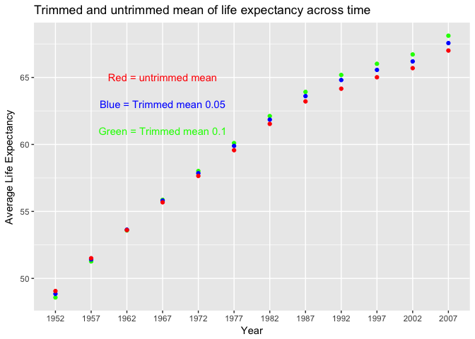
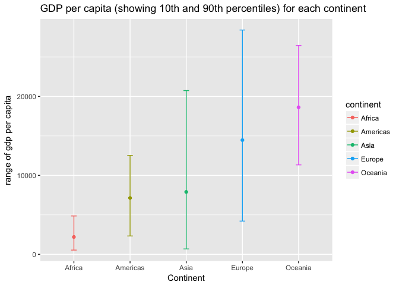
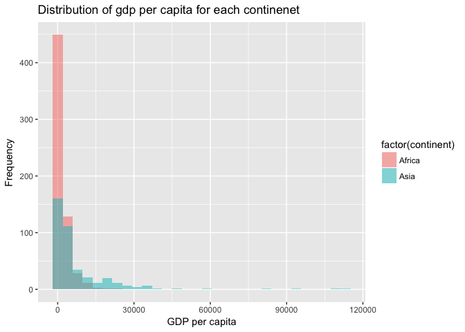
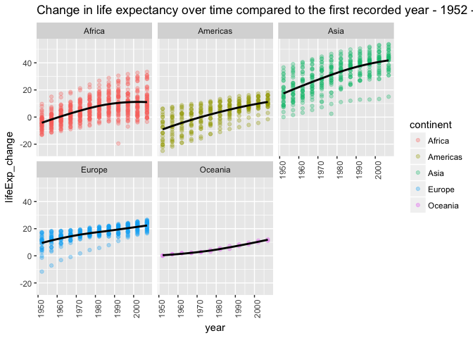
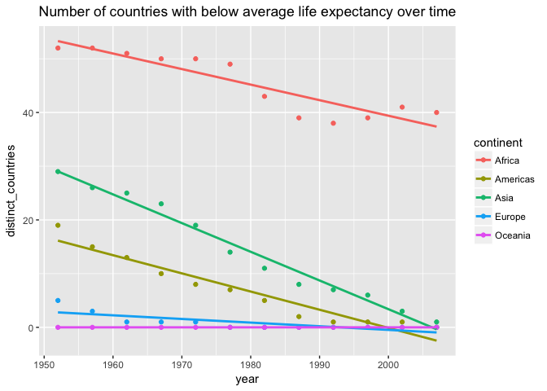
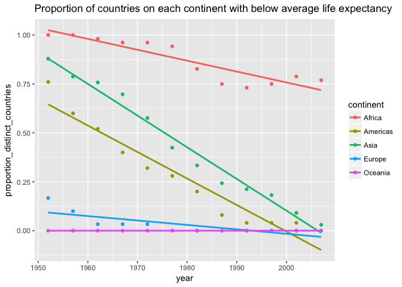

Exploration of Gapminder using dplyr and ggplot2
================
Lisa Wei
2017-09-30

### Loading required packages.

``` r
library(ggplot2)
library(dplyr)
library(gapminder)
```

### Task 1: Compute trimmed mean (and untrimmed mean) of life expectancy

<table>
<colgroup>
<col width="6%" />
<col width="31%" />
<col width="32%" />
<col width="28%" />
</colgroup>
<thead>
<tr class="header">
<th align="center">Year</th>
<th align="center">Trimmed (0.1) Average Life Expectancy</th>
<th align="center">Trimmed (0.05) Average Life Expectancy</th>
<th align="center">Untrimmed Average Life Expectancy</th>
</tr>
</thead>
<tbody>
<tr class="odd">
<td align="center">1952</td>
<td align="center">48.57668</td>
<td align="center">48.84636</td>
<td align="center">49.05762</td>
</tr>
<tr class="even">
<td align="center">1957</td>
<td align="center">51.26888</td>
<td align="center">51.41927</td>
<td align="center">51.50740</td>
</tr>
<tr class="odd">
<td align="center">1962</td>
<td align="center">53.58075</td>
<td align="center">53.63838</td>
<td align="center">53.60925</td>
</tr>
<tr class="even">
<td align="center">1967</td>
<td align="center">55.86538</td>
<td align="center">55.80484</td>
<td align="center">55.67829</td>
</tr>
<tr class="odd">
<td align="center">1972</td>
<td align="center">58.01444</td>
<td align="center">57.85226</td>
<td align="center">57.64739</td>
</tr>
<tr class="even">
<td align="center">1977</td>
<td align="center">60.10206</td>
<td align="center">59.88981</td>
<td align="center">59.57016</td>
</tr>
<tr class="odd">
<td align="center">1982</td>
<td align="center">62.11694</td>
<td align="center">61.85009</td>
<td align="center">61.53320</td>
</tr>
<tr class="even">
<td align="center">1987</td>
<td align="center">63.92106</td>
<td align="center">63.60734</td>
<td align="center">63.21261</td>
</tr>
<tr class="odd">
<td align="center">1992</td>
<td align="center">65.18519</td>
<td align="center">64.80741</td>
<td align="center">64.16034</td>
</tr>
<tr class="even">
<td align="center">1997</td>
<td align="center">66.01736</td>
<td align="center">65.56467</td>
<td align="center">65.01468</td>
</tr>
<tr class="odd">
<td align="center">2002</td>
<td align="center">66.71641</td>
<td align="center">66.19818</td>
<td align="center">65.69492</td>
</tr>
<tr class="even">
<td align="center">2007</td>
<td align="center">68.11489</td>
<td align="center">67.56459</td>
<td align="center">67.00742</td>
</tr>
</tbody>
</table>



As can be observed in the above plot, trimming the values before computing the mean does make a difference, and each of the trimmed means differ from the untrimmed mean. The greater the trim, the greater the increasing trend observed for later years.

### Task 2: Get the maximum and minimum of GDP per capita for all continents.

``` r
g2 <- gapminder %>%
    group_by(continent) %>% 
    summarize(min_gdpPercap = min(gdpPercap),
              max_gdpPercap = max(gdpPercap), dif=max(gdpPercap)-min(gdpPercap), mean=mean(gdpPercap))

g2 %>% knitr::kable(format="markdown",align=c(rep('c',times=7)), padding=2, col.names=c("Continent","Minimum gdp per capita","Maximum gdp per capita","Range","Average"))
```

| Continent | Minimum gdp per capita | Maximum gdp per capita |   Range   |  Average  |
|:---------:|:----------------------:|:----------------------:|:---------:|:---------:|
|   Africa  |        241.1659        |        21951.21        |  21710.05 |  2193.755 |
|  Americas |        1201.6372       |        42951.65        |  41750.02 |  7136.110 |
|    Asia   |        331.0000        |        113523.13       | 113192.13 |  7902.150 |
|   Europe  |        973.5332        |        49357.19        |  48383.66 | 14469.476 |
|  Oceania  |       10039.5956       |        34435.37        |  24395.77 | 18621.609 |

``` r
gapminder %>%
    group_by(continent) %>% 
    summarize(mean=mean(gdpPercap), q.1 = quantile(gdpPercap,0.1), q.9 = quantile(gdpPercap, 0.9)) %>%
      ggplot(aes(x = factor(continent), y=mean, fill=continent)) +         
        geom_point(aes(colour=continent)) +
          geom_errorbar(aes(ymin=q.1, ymax=q.9, colour=continent), width=.1) +
            xlab("Continent") + ylab("range of gdp per capita") + ggtitle("GDP per capita (showing 10th and 90th percentiles) for each continent")
```



As shown in the plot above, Asia and Europe seem to have the greatest distribution of values, as measured by the 10th and 9th percentiles. Though in the table, Asia has the greater range. Both the plot and table show Asia having a high distribution compared to other continents.

Task 3: Look at spread of gdp per capita for each continent
-----------------------------------------------------------

``` r
g3 <- gapminder %>%
  group_by(continent) %>%
  summarize(gdp_spread = sd(gdpPercap))

g3 %>% knitr::kable(format="markdown",align=c(rep('c',times=7)), padding=2, col.names=c("Continent","Spread of gdp per capita"))
```

| Continent | Spread of gdp per capita |
|:---------:|:------------------------:|
|   Africa  |         2827.930         |
|  Americas |         6396.764         |
|    Asia   |         14045.373        |
|   Europe  |         9355.213         |
|  Oceania  |         6358.983         |

Let's take the continents with the greatest and lowest spreads and plot their distributions to compare.

``` r
## take the continent with the highest and lowest spreads
gapminder %>%
  group_by(continent) %>% filter(continent %in% c("Africa","Asia")) %>% ggplot(aes(x=gdpPercap, fill=factor(continent))) + 
    geom_histogram(alpha = 0.5, position="identity") + ggtitle("Distribution of gdp per capita for each continenet") + xlab("GDP per capita") + ylab("Frequency")
```

    ## `stat_bin()` using `bins = 30`. Pick better value with `binwidth`.



Indeed, Asia has the greatest standard deviation, while Africa has the lowest. This corroborates nicely with the results from task 2 and the 10th and 90th quantiles computed for GDP per capita for each continent. Asia has the greatest range and distribution there as well. Thus these two tasks provide validation.

Change of life expectancy over time on different continents
-----------------------------------------------------------

``` r
p4 <- gapminder %>% 
     group_by(continent) %>%
     mutate(lifeExp_change = lifeExp - lifeExp[1])
```

Since the entire table would be too large to visualize, we will only take a look at the first few rows of the table showing changes in life expectancy over time for each continent.

``` r
head(p4) %>% knitr::kable(format="markdown",align=c(rep('c',times=7)), padding=2)
```

|   country   | continent | year | lifeExp |    pop   | gdpPercap | lifeExp\_change |
|:-----------:|:---------:|:----:|:-------:|:--------:|:---------:|:---------------:|
| Afghanistan |    Asia   | 1952 |  28.801 |  8425333 |  779.4453 |      0.000      |
| Afghanistan |    Asia   | 1957 |  30.332 |  9240934 |  820.8530 |      1.531      |
| Afghanistan |    Asia   | 1962 |  31.997 | 10267083 |  853.1007 |      3.196      |
| Afghanistan |    Asia   | 1967 |  34.020 | 11537966 |  836.1971 |      5.219      |
| Afghanistan |    Asia   | 1972 |  36.088 | 13079460 |  739.9811 |      7.287      |
| Afghanistan |    Asia   | 1977 |  38.438 | 14880372 |  786.1134 |      9.637      |

``` r
ggplot(p4, aes(x=year, y=lifeExp_change, colour=continent)) + 
    geom_point(alpha=0.3) + 
      facet_wrap(~continent) + 
          geom_smooth(se=FALSE, span=1, width=0.0001, colour="black") + theme(axis.text.x = element_text(angle = 90, hjust = 1)) +
            ggtitle("Change in life expectancy over time compared to the first recorded year - 1952 - per continent")
```

    ## Warning: Ignoring unknown parameters: width

    ## `geom_smooth()` using method = 'loess'



There seems to be an increasing trend in life expectancy for all continents, although Asia seems to have the greatest rate of increase as shown by a steeper curve.

### Task 5: Number of countries on each continent that have a life expectancy, for each year, that's less than the mean of world-wide life expectancy for all years recorded

1.  Calcuate the mean life expectancy: 59.47444 yrs

|  mean\_lifeExp|
|--------------:|
|       59.47444|

| continent | year | distinct\_countries |
|:---------:|:----:|:-------------------:|
|   Africa  | 1952 |          52         |
|   Africa  | 1957 |          52         |
|   Africa  | 1962 |          51         |
|   Africa  | 1967 |          50         |
|   Africa  | 1972 |          50         |
|   Africa  | 1977 |          49         |
|   Africa  | 1982 |          43         |
|   Africa  | 1987 |          39         |
|   Africa  | 1992 |          38         |
|   Africa  | 1997 |          39         |
|   Africa  | 2002 |          41         |
|   Africa  | 2007 |          40         |
|  Americas | 1952 |          19         |
|  Americas | 1957 |          15         |
|  Americas | 1962 |          13         |
|  Americas | 1967 |          10         |
|  Americas | 1972 |          8          |
|  Americas | 1977 |          7          |
|  Americas | 1982 |          5          |
|  Americas | 1987 |          2          |
|  Americas | 1992 |          1          |
|  Americas | 1997 |          1          |
|  Americas | 2002 |          1          |
|    Asia   | 1952 |          29         |
|    Asia   | 1957 |          26         |
|    Asia   | 1962 |          25         |
|    Asia   | 1967 |          23         |
|    Asia   | 1972 |          19         |
|    Asia   | 1977 |          14         |
|    Asia   | 1982 |          11         |
|    Asia   | 1987 |          8          |
|    Asia   | 1992 |          7          |
|    Asia   | 1997 |          6          |
|    Asia   | 2002 |          3          |
|    Asia   | 2007 |          1          |
|   Europe  | 1952 |          5          |
|   Europe  | 1957 |          3          |
|   Europe  | 1962 |          1          |
|   Europe  | 1967 |          1          |
|   Europe  | 1972 |          1          |

1.  Retrieve the absolute number of countries, over time, with life expectancies greater than the above mean of 59.47444 years, for each continent. Then, visualize with a plotshowing trends over time per continent.



1.  Retrieve the proportion of countries on each continent (absolute number divided by the total number of countries in each continent), over time, with life expectancies greater than the above mean of 59.47444 years, for each continent. Then, visualize with a plotshowing trends over time per continent.

``` r
e1 <-  gapminder %>%  
        group_by(continent,year) %>% 
          summarize(proportion_distinct_countries=n_distinct(country[lifeExp < 59.47444])/n_distinct(country))

e1 %>% knitr::kable(format="markdown",align=c(rep('c',times=7)), padding=2)
```

| continent | year | proportion\_distinct\_countries |
|:---------:|:----:|:-------------------------------:|
|   Africa  | 1952 |            1.0000000            |
|   Africa  | 1957 |            1.0000000            |
|   Africa  | 1962 |            0.9807692            |
|   Africa  | 1967 |            0.9615385            |
|   Africa  | 1972 |            0.9615385            |
|   Africa  | 1977 |            0.9423077            |
|   Africa  | 1982 |            0.8269231            |
|   Africa  | 1987 |            0.7500000            |
|   Africa  | 1992 |            0.7307692            |
|   Africa  | 1997 |            0.7500000            |
|   Africa  | 2002 |            0.7884615            |
|   Africa  | 2007 |            0.7692308            |
|  Americas | 1952 |            0.7600000            |
|  Americas | 1957 |            0.6000000            |
|  Americas | 1962 |            0.5200000            |
|  Americas | 1967 |            0.4000000            |
|  Americas | 1972 |            0.3200000            |
|  Americas | 1977 |            0.2800000            |
|  Americas | 1982 |            0.2000000            |
|  Americas | 1987 |            0.0800000            |
|  Americas | 1992 |            0.0400000            |
|  Americas | 1997 |            0.0400000            |
|  Americas | 2002 |            0.0400000            |
|  Americas | 2007 |            0.0000000            |
|    Asia   | 1952 |            0.8787879            |
|    Asia   | 1957 |            0.7878788            |
|    Asia   | 1962 |            0.7575758            |
|    Asia   | 1967 |            0.6969697            |
|    Asia   | 1972 |            0.5757576            |
|    Asia   | 1977 |            0.4242424            |
|    Asia   | 1982 |            0.3333333            |
|    Asia   | 1987 |            0.2424242            |
|    Asia   | 1992 |            0.2121212            |
|    Asia   | 1997 |            0.1818182            |
|    Asia   | 2002 |            0.0909091            |
|    Asia   | 2007 |            0.0303030            |
|   Europe  | 1952 |            0.1666667            |
|   Europe  | 1957 |            0.1000000            |
|   Europe  | 1962 |            0.0333333            |
|   Europe  | 1967 |            0.0333333            |
|   Europe  | 1972 |            0.0333333            |
|   Europe  | 1977 |            0.0000000            |
|   Europe  | 1982 |            0.0000000            |
|   Europe  | 1987 |            0.0000000            |
|   Europe  | 1992 |            0.0000000            |
|   Europe  | 1997 |            0.0000000            |
|   Europe  | 2002 |            0.0000000            |
|   Europe  | 2007 |            0.0000000            |
|  Oceania  | 1952 |            0.0000000            |
|  Oceania  | 1957 |            0.0000000            |
|  Oceania  | 1962 |            0.0000000            |
|  Oceania  | 1967 |            0.0000000            |
|  Oceania  | 1972 |            0.0000000            |
|  Oceania  | 1977 |            0.0000000            |
|  Oceania  | 1982 |            0.0000000            |
|  Oceania  | 1987 |            0.0000000            |
|  Oceania  | 1992 |            0.0000000            |
|  Oceania  | 1997 |            0.0000000            |
|  Oceania  | 2002 |            0.0000000            |
|  Oceania  | 2007 |            0.0000000            |

``` r
 gapminder %>%  
      group_by(continent,year) %>% 
        summarize(proportion_distinct_countries=n_distinct(country[lifeExp < 59.47444])/n_distinct(country)) %>% 
          ggplot(aes(x=year,y=proportion_distinct_countries, colour=continent)) + geom_point() + geom_smooth(method="lm",se=F) +
            ggtitle("Proportion of countries on each continent with below average life expectancy")
```



### Trends:

1.  All continents show a decreasing trend in terms of the number of countries with lower than average life expectancy, over time. Oceania did not have any countries with below average life expectancy to begin with.

2.  Aside form Oceania, Europe as the earliest in terms of achieving zero countries with below average life expectancy. Africa had the greatest number of countries at each year with below average life expectancy.

3.  When scaled by the total number of countries per continent, one can better observe that the starting point at 1952 for Asia and Africa are not so different, but Asia saw a steep decline in below average life expectancy compared to Africa over time. Trend is similar for Asia and Americas.

### Report your process

1.  I couldn't figure out how to format the trimmed and untrimmed averages of life expectancy such that `ggplot2()` would output a proper legend labelling which colour of the points correpond to which type of average. I tried a number of `ggplot2` functions like `scale_fill_discrete()`, `guide()`, and `scale_fill_manual()` but none of them worked. So in the end, I just manually added text to explain relationship between colour of points and trimmed/untrimmed averages.

2.  I realized after I completed the first draft of the assignment that having the relative number of countries with below average life expectancy would make more sense since it is not as meaningful to look at absolute numbers without scaling. And in trying to add a second table of relative number of countries, I realized that when I had originally filtered out all rows in gapminder with life expectancy greater than the average life expectancy, this actually resulted in all countries in Oceania being eliminated. So I took out the `filter()` step, and instead just specified `n_distinct(country[lifeExp < 59.47444])` when calculating either absolute or relative numbers using the `summarize()` function.

### Resources

1.  <https://github.com/STAT545-UBC/Discussion/issues/132>
2.  <http://ggplot2.tidyverse.org/reference/stat_summary.html>
