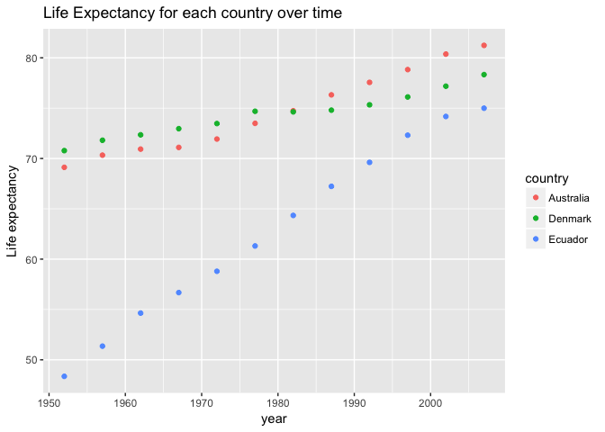

Tidy data and joins
================
Lisa Wei
2017-10-07

General data reshaping and relationship to aggregation
------------------------------------------------------

### Activity \#2

Make a tibble with one row per year and columns for life expectancy for two or more countries. Use knitr::kable() to make this table look pretty in your rendered homework. Take advantage of this new data shape to scatterplot life expectancy for one country against that of another.

``` r
library(tidyverse)
library(dplyr)
library(ggplot2)
library(gapminder)
```

``` r
df <- gapminder %>% select(year, lifeExp, country) %>% distinct() %>% filter(country %in% c("Australia","Ecuador","Denmark")) %>% arrange(year) 

df <- as_tibble(df)

df2 <- df %>% gather(key="Measure", value="Units", lifeExp)

df2 %>% knitr::kable(format="markdown",align=c(rep('c',times=7)), padding=2)   
```

| year |  country  | Measure |  Units |
|:----:|:---------:|:-------:|:------:|
| 1952 | Australia | lifeExp | 69.120 |
| 1952 |  Denmark  | lifeExp | 70.780 |
| 1952 |  Ecuador  | lifeExp | 48.357 |
| 1957 | Australia | lifeExp | 70.330 |
| 1957 |  Denmark  | lifeExp | 71.810 |
| 1957 |  Ecuador  | lifeExp | 51.356 |
| 1962 | Australia | lifeExp | 70.930 |
| 1962 |  Denmark  | lifeExp | 72.350 |
| 1962 |  Ecuador  | lifeExp | 54.640 |
| 1967 | Australia | lifeExp | 71.100 |
| 1967 |  Denmark  | lifeExp | 72.960 |
| 1967 |  Ecuador  | lifeExp | 56.678 |
| 1972 | Australia | lifeExp | 71.930 |
| 1972 |  Denmark  | lifeExp | 73.470 |
| 1972 |  Ecuador  | lifeExp | 58.796 |
| 1977 | Australia | lifeExp | 73.490 |
| 1977 |  Denmark  | lifeExp | 74.690 |
| 1977 |  Ecuador  | lifeExp | 61.310 |
| 1982 | Australia | lifeExp | 74.740 |
| 1982 |  Denmark  | lifeExp | 74.630 |
| 1982 |  Ecuador  | lifeExp | 64.342 |
| 1987 | Australia | lifeExp | 76.320 |
| 1987 |  Denmark  | lifeExp | 74.800 |
| 1987 |  Ecuador  | lifeExp | 67.231 |
| 1992 | Australia | lifeExp | 77.560 |
| 1992 |  Denmark  | lifeExp | 75.330 |
| 1992 |  Ecuador  | lifeExp | 69.613 |
| 1997 | Australia | lifeExp | 78.830 |
| 1997 |  Denmark  | lifeExp | 76.110 |
| 1997 |  Ecuador  | lifeExp | 72.312 |
| 2002 | Australia | lifeExp | 80.370 |
| 2002 |  Denmark  | lifeExp | 77.180 |
| 2002 |  Ecuador  | lifeExp | 74.173 |
| 2007 | Australia | lifeExp | 81.235 |
| 2007 |  Denmark  | lifeExp | 78.332 |
| 2007 |  Ecuador  | lifeExp | 74.994 |

``` r
ggplot(df2, aes(x=year, y=Units, colour=country)) + 
  geom_point() +
  ylab("Life expectancy") +
  ggtitle("Life Expectancy for each country over time")
```



### Activity \#3

Compute some measure of life expectancy (mean? median? min? max?) for all possible combinations of continent and year. Reshape that to have one row per year and one variable for each continent. Or the other way around: one row per continent and one variable per year. Use knitr::kable() to make these tables look pretty in your rendered homework. Is there a plot that is easier to make with the data in this shape versis the usual form? If so (or you think so), try it! Reflect.

``` r
df3 <- gapminder %>% select(year, lifeExp, continent) %>% distinct() %>% group_by(year,continent) %>% summarize(avg_lifeExp=mean(lifeExp))

## pre-reshaping:
df3 %>% knitr::kable(format="markdown",align=c(rep('c',times=7)), padding=2)
```

| year | continent | avg\_lifeExp |
|:----:|:---------:|:------------:|
| 1952 |   Africa  |   39.13550   |
| 1952 |  Americas |   53.27984   |
| 1952 |    Asia   |   46.31439   |
| 1952 |   Europe  |   64.40850   |
| 1952 |  Oceania  |   69.25500   |
| 1957 |   Africa  |   41.26635   |
| 1957 |  Americas |   55.96028   |
| 1957 |    Asia   |   49.31854   |
| 1957 |   Europe  |   66.70307   |
| 1957 |  Oceania  |   70.29500   |
| 1962 |   Africa  |   43.31944   |
| 1962 |  Americas |   58.39876   |
| 1962 |    Asia   |   51.56322   |
| 1962 |   Europe  |   68.50576   |
| 1962 |  Oceania  |   71.08500   |
| 1967 |   Africa  |   45.33454   |
| 1967 |  Americas |   60.41092   |
| 1967 |    Asia   |   54.66364   |
| 1967 |   Europe  |   69.73760   |
| 1967 |  Oceania  |   71.31000   |
| 1972 |   Africa  |   47.45094   |
| 1972 |  Americas |   62.39492   |
| 1972 |    Asia   |   57.31927   |
| 1972 |   Europe  |   70.77503   |
| 1972 |  Oceania  |   71.91000   |
| 1977 |   Africa  |   49.58042   |
| 1977 |  Americas |   64.39156   |
| 1977 |    Asia   |   59.61056   |
| 1977 |   Europe  |   71.93777   |
| 1977 |  Oceania  |   72.85500   |
| 1982 |   Africa  |   51.59287   |
| 1982 |  Americas |   66.22884   |
| 1982 |    Asia   |   62.61794   |
| 1982 |   Europe  |   72.80640   |
| 1982 |  Oceania  |   74.29000   |
| 1987 |   Africa  |   53.34479   |
| 1987 |  Americas |   68.09072   |
| 1987 |    Asia   |   64.85118   |
| 1987 |   Europe  |   73.64217   |
| 1987 |  Oceania  |   75.32000   |
| 1992 |   Africa  |   53.62958   |
| 1992 |  Americas |   69.56836   |
| 1992 |    Asia   |   66.53721   |
| 1992 |   Europe  |   74.44010   |
| 1992 |  Oceania  |   76.94500   |
| 1997 |   Africa  |   53.59827   |
| 1997 |  Americas |   71.15048   |
| 1997 |    Asia   |   68.02052   |
| 1997 |   Europe  |   75.50517   |
| 1997 |  Oceania  |   78.19000   |
| 2002 |   Africa  |   53.32523   |
| 2002 |  Americas |   72.42204   |
| 2002 |    Asia   |   69.23388   |
| 2002 |   Europe  |   76.70060   |
| 2002 |  Oceania  |   79.74000   |
| 2007 |   Africa  |   54.80604   |
| 2007 |  Americas |   73.60812   |
| 2007 |    Asia   |   70.72848   |
| 2007 |   Europe  |   77.64860   |
| 2007 |  Oceania  |   80.71950   |

``` r
df4 <- df3 %>% gather(key = "Measure", value = "Units", year:continent)
```

``` r
## post reshaping
df4 %>% knitr::kable(format="markdown",align=c(rep('c',times=7)), padding=2)
```

| avg\_lifeExp |  Measure  |   Units  |
|:------------:|:---------:|:--------:|
|   39.13550   |    year   |   1952   |
|   53.27984   |    year   |   1952   |
|   46.31439   |    year   |   1952   |
|   64.40850   |    year   |   1952   |
|   69.25500   |    year   |   1952   |
|   41.26635   |    year   |   1957   |
|   55.96028   |    year   |   1957   |
|   49.31854   |    year   |   1957   |
|   66.70307   |    year   |   1957   |
|   70.29500   |    year   |   1957   |
|   43.31944   |    year   |   1962   |
|   58.39876   |    year   |   1962   |
|   51.56322   |    year   |   1962   |
|   68.50576   |    year   |   1962   |
|   71.08500   |    year   |   1962   |
|   45.33454   |    year   |   1967   |
|   60.41092   |    year   |   1967   |
|   54.66364   |    year   |   1967   |
|   69.73760   |    year   |   1967   |
|   71.31000   |    year   |   1967   |
|   47.45094   |    year   |   1972   |
|   62.39492   |    year   |   1972   |
|   57.31927   |    year   |   1972   |
|   70.77503   |    year   |   1972   |
|   71.91000   |    year   |   1972   |
|   49.58042   |    year   |   1977   |
|   64.39156   |    year   |   1977   |
|   59.61056   |    year   |   1977   |
|   71.93777   |    year   |   1977   |
|   72.85500   |    year   |   1977   |
|   51.59287   |    year   |   1982   |
|   66.22884   |    year   |   1982   |
|   62.61794   |    year   |   1982   |
|   72.80640   |    year   |   1982   |
|   74.29000   |    year   |   1982   |
|   53.34479   |    year   |   1987   |
|   68.09072   |    year   |   1987   |
|   64.85118   |    year   |   1987   |
|   73.64217   |    year   |   1987   |
|   75.32000   |    year   |   1987   |
|   53.62958   |    year   |   1992   |
|   69.56836   |    year   |   1992   |
|   66.53721   |    year   |   1992   |
|   74.44010   |    year   |   1992   |
|   76.94500   |    year   |   1992   |
|   53.59827   |    year   |   1997   |
|   71.15048   |    year   |   1997   |
|   68.02052   |    year   |   1997   |
|   75.50517   |    year   |   1997   |
|   78.19000   |    year   |   1997   |
|   53.32523   |    year   |   2002   |
|   72.42204   |    year   |   2002   |
|   69.23388   |    year   |   2002   |
|   76.70060   |    year   |   2002   |
|   79.74000   |    year   |   2002   |
|   54.80604   |    year   |   2007   |
|   73.60812   |    year   |   2007   |
|   70.72848   |    year   |   2007   |
|   77.64860   |    year   |   2007   |
|   80.71950   |    year   |   2007   |
|   39.13550   | continent |  Africa  |
|   53.27984   | continent | Americas |
|   46.31439   | continent |   Asia   |
|   64.40850   | continent |  Europe  |
|   69.25500   | continent |  Oceania |
|   41.26635   | continent |  Africa  |
|   55.96028   | continent | Americas |
|   49.31854   | continent |   Asia   |
|   66.70307   | continent |  Europe  |
|   70.29500   | continent |  Oceania |
|   43.31944   | continent |  Africa  |
|   58.39876   | continent | Americas |
|   51.56322   | continent |   Asia   |
|   68.50576   | continent |  Europe  |
|   71.08500   | continent |  Oceania |
|   45.33454   | continent |  Africa  |
|   60.41092   | continent | Americas |
|   54.66364   | continent |   Asia   |
|   69.73760   | continent |  Europe  |
|   71.31000   | continent |  Oceania |
|   47.45094   | continent |  Africa  |
|   62.39492   | continent | Americas |
|   57.31927   | continent |   Asia   |
|   70.77503   | continent |  Europe  |
|   71.91000   | continent |  Oceania |
|   49.58042   | continent |  Africa  |
|   64.39156   | continent | Americas |
|   59.61056   | continent |   Asia   |
|   71.93777   | continent |  Europe  |
|   72.85500   | continent |  Oceania |
|   51.59287   | continent |  Africa  |
|   66.22884   | continent | Americas |
|   62.61794   | continent |   Asia   |
|   72.80640   | continent |  Europe  |
|   74.29000   | continent |  Oceania |
|   53.34479   | continent |  Africa  |
|   68.09072   | continent | Americas |
|   64.85118   | continent |   Asia   |
|   73.64217   | continent |  Europe  |
|   75.32000   | continent |  Oceania |
|   53.62958   | continent |  Africa  |
|   69.56836   | continent | Americas |
|   66.53721   | continent |   Asia   |
|   74.44010   | continent |  Europe  |
|   76.94500   | continent |  Oceania |
|   53.59827   | continent |  Africa  |
|   71.15048   | continent | Americas |
|   68.02052   | continent |   Asia   |
|   75.50517   | continent |  Europe  |
|   78.19000   | continent |  Oceania |
|   53.32523   | continent |  Africa  |
|   72.42204   | continent | Americas |
|   69.23388   | continent |   Asia   |
|   76.70060   | continent |  Europe  |
|   79.74000   | continent |  Oceania |
|   54.80604   | continent |  Africa  |
|   73.60812   | continent | Americas |
|   70.72848   | continent |   Asia   |
|   77.64860   | continent |  Europe  |
|   80.71950   | continent |  Oceania |

``` r
## range of average life expectancies found for each year and on each continent
df4 %>% 
    ggplot(aes(x = avg_lifeExp, y = Units, colour=Measure)) + 
    geom_line() + 
    ylab("Average life expectancy") +
    xlab("Average life expectancy") + 
    ggtitle("Range of average life expectancy for each year and for each continent")
```


### The plot above would be difficult to do with the original data without reshaping since it would be impossible to plot the range of data for each year and continent on the same plot.

With the original data, the only natural plot to do would be looking at the life expectancy values over time, each line coloured by the continent.

``` r
df3 %>% ggplot(aes(x = year, y = avg_lifeExp, colour=continent)) + 
    geom_line() +
    ylab("Average life expectancy") +
    ggtitle("Average life expectancy over time for each continent")
```


Join, merge, look up
--------------------

### Activity \#1

Create a second data frame, complementary to Gapminder. Join this with (part of) Gapminder using a dplyr join function and make some observations about the process and result. Explore the different types of joins.

-   Create a second data frame called "hemisphere" of all continents, and whether it is in sourthern or northern hemisphere. Modify the original gapminder dataframe such that the new table only contains information about the average life expectancy for each continent. This is so that it would be easier to observe/compare output of various `join()` functions.

``` r
## create "hemisphere" data frame

hemisphere <- gapminder %>% 
              select(continent) %>% 
              distinct()  %>% 
              mutate(hemisphere=c("Northern","Northern","Southern and Northern","Southern and Northern","Southern and Northern"))

## create "gapminder_avg_lifeExp" data frame
gapminder_avg_lifeExp <- gapminder %>% 
                          group_by(continent) %>% 
                          summarize(avg_lifeExp=mean(lifeExp))
```

-   Join hemisphere with gapminder average life expectancy (while keeping all of hemisphere information) by matching using continent: Use `left_join()`

``` r
hemisphere_info_leftjoin <- gapminder_avg_lifeExp %>% left_join(hemisphere)

dim(hemisphere_info_leftjoin)
```

    ## [1] 5 3

``` r
hemisphere_info_leftjoin %>% knitr::kable(format="markdown",align=c(rep('c',times=7)), padding=2)
```

| continent | avg\_lifeExp |       hemisphere      |
|:---------:|:------------:|:---------------------:|
|   Africa  |   48.86533   | Southern and Northern |
|  Americas |   64.65874   | Southern and Northern |
|    Asia   |   60.06490   |        Northern       |
|   Europe  |   71.90369   |        Northern       |
|  Oceania  |   74.32621   | Southern and Northern |

Exploring other types of joins with the data frames above
---------------------------------------------------------

-   `inner_join()` would include rows that appear in both gapminder\_avg\_lifeExp and hemisphere, and returns all columns from both data set.

``` r
hemisphere_info_rightjoin <- gapminder_avg_lifeExp %>% inner_join(hemisphere) 

dim(hemisphere_info_rightjoin)
```

    ## [1] 5 3

``` r
hemisphere_info_rightjoin %>% knitr::kable(format="markdown",align=c(rep('c',times=7)), padding=2)
```

| continent | avg\_lifeExp |       hemisphere      |
|:---------:|:------------:|:---------------------:|
|   Africa  |   48.86533   | Southern and Northern |
|  Americas |   64.65874   | Southern and Northern |
|    Asia   |   60.06490   |        Northern       |
|   Europe  |   71.90369   |        Northern       |
|  Oceania  |   74.32621   | Southern and Northern |

-   `full_join()` returns all rows and all columns from both gapminder and hemisphere. Where there are not matching values, returns NA for the one missing.

``` r
hemisphere_info_fulljoin <- gapminder_avg_lifeExp %>% full_join(hemisphere) 

dim(hemisphere_info_fulljoin)
```

    ## [1] 5 3

``` r
hemisphere_info_fulljoin %>% knitr::kable(format="markdown",align=c(rep('c',times=7)), padding=2)
```

| continent | avg\_lifeExp |       hemisphere      |
|:---------:|:------------:|:---------------------:|
|   Africa  |   48.86533   | Southern and Northern |
|  Americas |   64.65874   | Southern and Northern |
|    Asia   |   60.06490   |        Northern       |
|   Europe  |   71.90369   |        Northern       |
|  Oceania  |   74.32621   | Southern and Northern |

-   `anti_join()` outputs an empty table since gapminder and hemisphere share the same continents. This function returns all rows from gapminder where there are not matching values in hemisphere, keeping just columns from x.

``` r
hemisphere_info_antijoin <- gapminder_avg_lifeExp %>% anti_join(hemisphere) 

dim(hemisphere_info_antijoin)
```

    ## [1] 0 2

``` r
hemisphere_info_antijoin %>% knitr::kable(format="markdown",align=c(rep('c',times=7)), padding=2)
```

| continent | avg\_lifeExp |
|:---------:|:------------:|

-   `semi_join()` Return all rows from gapminder where there are matching values in hemisphere, keeping just columns from gapminder.

``` r
hemisphere_info_semijoin <- gapminder_avg_lifeExp %>% semi_join(hemisphere) 

dim(hemisphere_info_semijoin)
```

    ## [1] 5 2

``` r
hemisphere_info_semijoin %>% knitr::kable(format="markdown",align=c(rep('c',times=7)), padding=2)
```

| continent | avg\_lifeExp |
|:---------:|:------------:|
|    Asia   |   60.06490   |
|   Europe  |   71.90369   |
|   Africa  |   48.86533   |
|  Americas |   64.65874   |
|  Oceania  |   74.32621   |

### Explore the base function merge(), which also does joins. Compare and contrast with dplyr joins

-   compare `merge()` with `join()` functions: `merge(x,y,all=TRUE)` achieves the same effect as a `full_join()`.

``` r
merged <- merge(gapminder_avg_lifeExp,hemisphere, all=TRUE)

dim(merged)
```

    ## [1] 5 3

``` r
merged %>% knitr::kable(format="markdown",align=c(rep('c',times=7)), padding=2)
```

| continent | avg\_lifeExp |       hemisphere      |
|:---------:|:------------:|:---------------------:|
|   Africa  |   48.86533   | Southern and Northern |
|  Americas |   64.65874   | Southern and Northern |
|    Asia   |   60.06490   |        Northern       |
|   Europe  |   71.90369   |        Northern       |
|  Oceania  |   74.32621   | Southern and Northern |

### Resources:

<https://github.com/tidyverse/dplyr/issues/1150>

<http://stat545.com/bit001_dplyr-cheatsheet.html#semi_joinsuperheroes-publishers>
