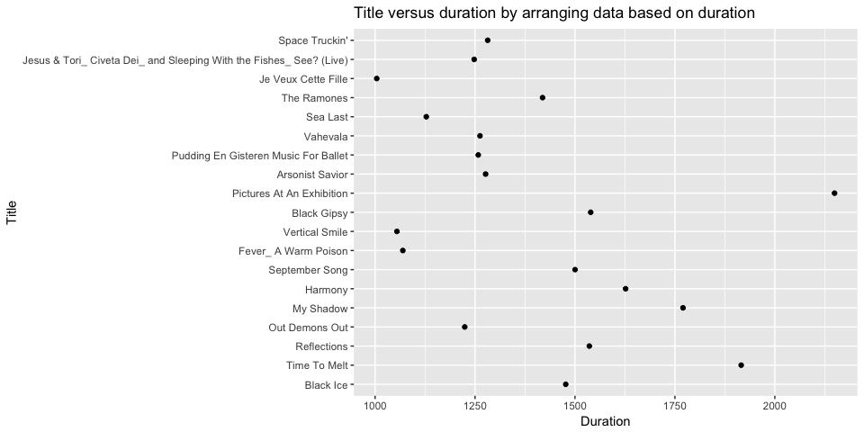
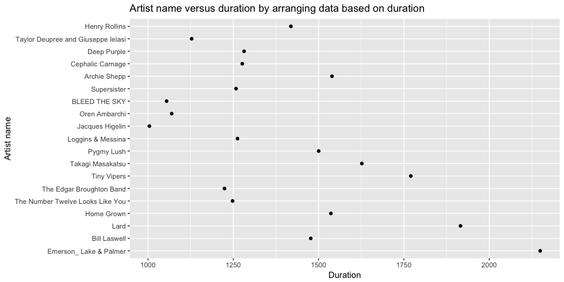
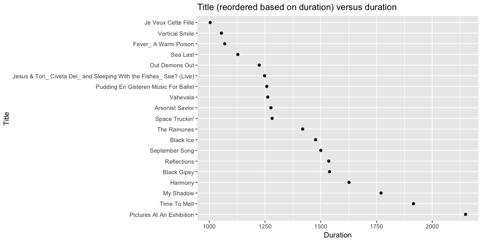
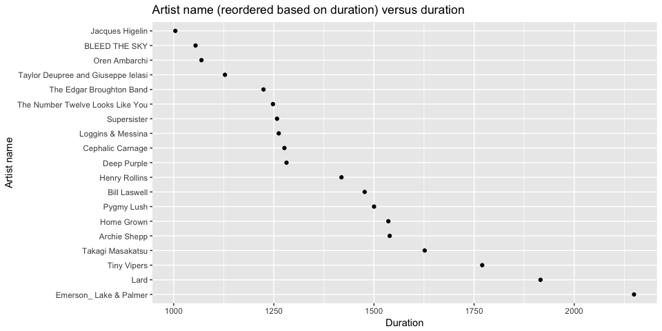
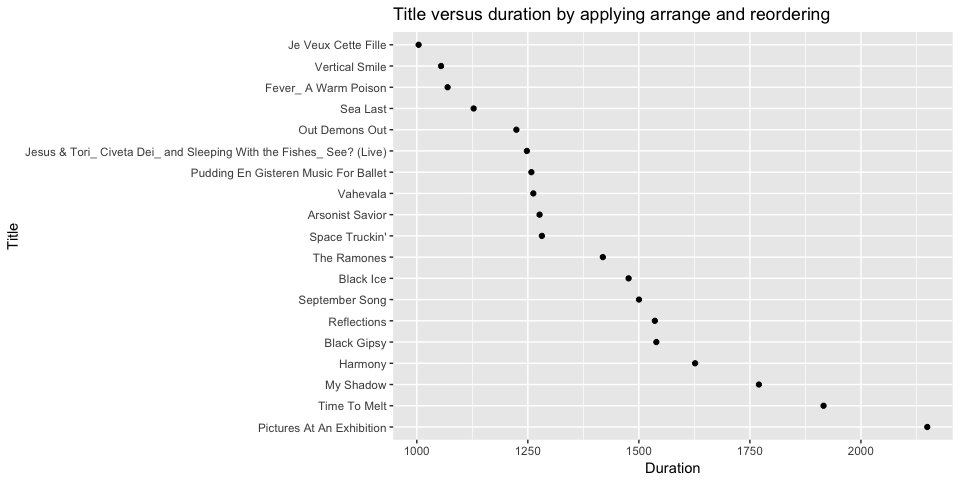
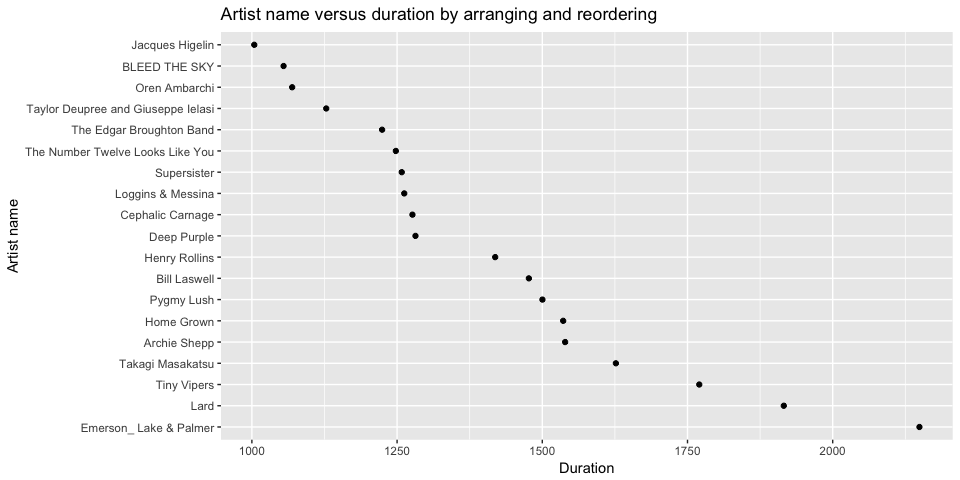
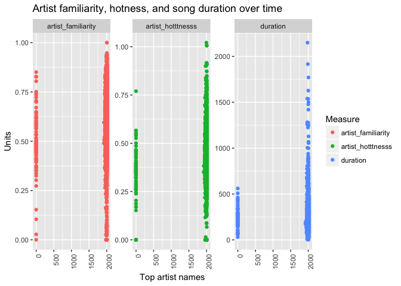
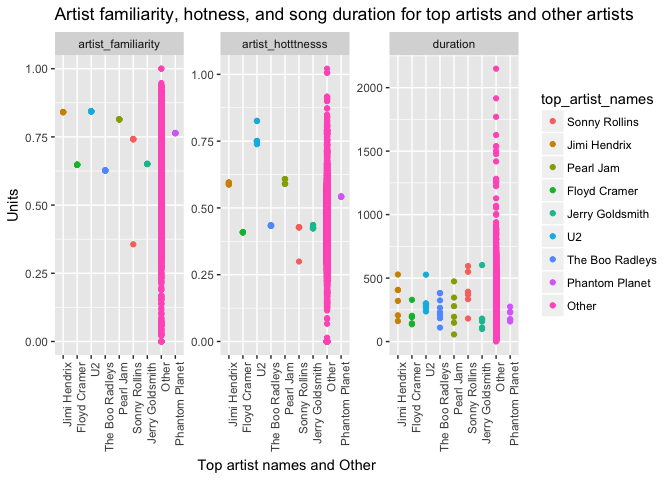
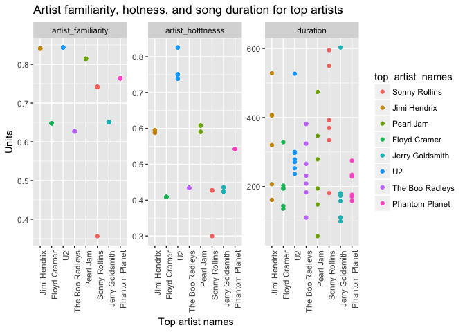
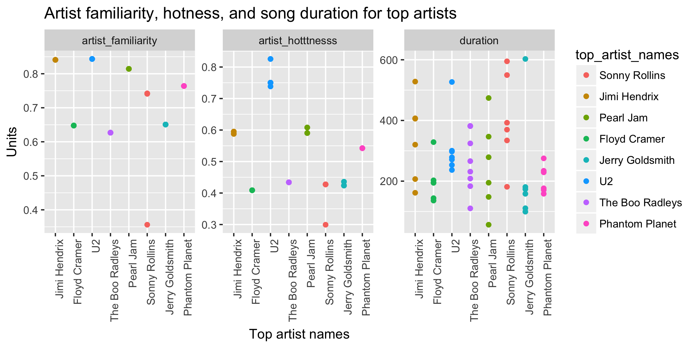

hw05 Factor and Figure Management
================
Lisa Wei
2017-10-15

``` r
library(singer)
library(tidyverse)
library(dplyr)
library(forcats)
library(readr)
library(readxl)
```

Task 1: Factor management
-------------------------

### Singer version:

Factorise. Transform some of the variable in the singer\_locations dataframe into factors: pay attention at what levels you introduce and their order. Try and consider the difference between the base R as.factor and the forcats-provided functions.

``` r
data("singer_locations")

#track_id and title are originally of type "character"
typeof(singer::singer_locations$track_id)
```

    ## [1] "character"

``` r
typeof(singer::singer_locations$title)
```

    ## [1] "character"

``` r
## transform into factor
sl <- singer_locations %>% mutate(artist_name_factor = as_factor(artist_name), title_factor = as_factor(title))   ### as_factor() is safer
glimpse(sl)
```

    ## Observations: 10,100
    ## Variables: 16
    ## $ track_id           <chr> "TRWICRA128F42368DB", "TRXJANY128F42246FC",...
    ## $ title              <chr> "The Conversation (Cd)", "Lonely Island", "...
    ## $ song_id            <chr> "SOSURTI12A81C22FB8", "SODESQP12A6D4F98EF",...
    ## $ release            <chr> "Even If It Kills Me", "The Duke Of Earl", ...
    ## $ artist_id          <chr> "ARACDPV1187FB58DF4", "ARYBUAO1187FB3F4EB",...
    ## $ artist_name        <chr> "Motion City Soundtrack", "Gene Chandler", ...
    ## $ year               <int> 2007, 2004, 1998, 1995, 1968, 2006, 2003, 2...
    ## $ duration           <dbl> 170.4485, 106.5530, 527.5947, 695.1179, 237...
    ## $ artist_hotttnesss  <dbl> 0.6410183, 0.3937627, 0.4306226, 0.3622792,...
    ## $ artist_familiarity <dbl> 0.8230522, 0.5700167, 0.5039940, 0.4773099,...
    ## $ latitude           <dbl> NA, 41.88415, 40.71455, NA, 42.33168, 40.99...
    ## $ longitude          <dbl> NA, -87.63241, -74.00712, NA, -83.04792, -7...
    ## $ name               <chr> NA, "Gene Chandler", "Paul Horn", NA, "Doro...
    ## $ city               <chr> NA, "Chicago, IL", "New York, NY", NA, "Det...
    ## $ artist_name_factor <fctr> Motion City Soundtrack, Gene Chandler, Pau...
    ## $ title_factor       <fctr> The Conversation (Cd), Lonely Island, Here...

``` r
## can't convert "integer" to "factor"
# as_factor(sl$year) outputs an error

head(sl$artist_name_factor)
```

    ## [1] Motion City Soundtrack         Gene Chandler                 
    ## [3] Paul Horn                      Ronnie Earl & the Broadcasters
    ## [5] Dorothy Ashby                  Barleyjuice                   
    ## 7498 Levels: Motion City Soundtrack Gene Chandler ... Charlie Hall

``` r
head(sl$title_factor)
```

    ## [1] The Conversation (Cd) Lonely Island         Here's That Rainy Day
    ## [4] Rego Park Blues       Games                 More Pipes           
    ## 9799 Levels: The Conversation (Cd) Lonely Island ... Waking Up (Key-Bb-Premiere Performance Plus)

### Drop 0.

Filter the singer\_locations data to remove observations associated with the incorrect input year 0. Additionally, remove unused factor levels. Provide concrete information on the data before and after removing these rows and levels; address the number of rows and the levels of the affected factors.

``` r
sl_year0_dropped <- sl %>% 
  mutate(year_drop0 = ifelse(year==0,"drop0",year))  %>% filter(year_drop0!="drop0")

## 100 instances of year==0

glimpse(sl_year0_dropped)
```

    ## Observations: 10,000
    ## Variables: 17
    ## $ track_id           <chr> "TRWICRA128F42368DB", "TRXJANY128F42246FC",...
    ## $ title              <chr> "The Conversation (Cd)", "Lonely Island", "...
    ## $ song_id            <chr> "SOSURTI12A81C22FB8", "SODESQP12A6D4F98EF",...
    ## $ release            <chr> "Even If It Kills Me", "The Duke Of Earl", ...
    ## $ artist_id          <chr> "ARACDPV1187FB58DF4", "ARYBUAO1187FB3F4EB",...
    ## $ artist_name        <chr> "Motion City Soundtrack", "Gene Chandler", ...
    ## $ year               <int> 2007, 2004, 1998, 1995, 1968, 2006, 2003, 2...
    ## $ duration           <dbl> 170.4485, 106.5530, 527.5947, 695.1179, 237...
    ## $ artist_hotttnesss  <dbl> 0.6410183, 0.3937627, 0.4306226, 0.3622792,...
    ## $ artist_familiarity <dbl> 0.8230522, 0.5700167, 0.5039940, 0.4773099,...
    ## $ latitude           <dbl> NA, 41.88415, 40.71455, NA, 42.33168, 40.99...
    ## $ longitude          <dbl> NA, -87.63241, -74.00712, NA, -83.04792, -7...
    ## $ name               <chr> NA, "Gene Chandler", "Paul Horn", NA, "Doro...
    ## $ city               <chr> NA, "Chicago, IL", "New York, NY", NA, "Det...
    ## $ artist_name_factor <fctr> Motion City Soundtrack, Gene Chandler, Pau...
    ## $ title_factor       <fctr> The Conversation (Cd), Lonely Island, Here...
    ## $ year_drop0         <chr> "2007", "2004", "1998", "1995", "1968", "20...

``` r
which(sl$year_drop0=="drop0")
```

    ## integer(0)

``` r
dim(sl)
```

    ## [1] 10100    16

``` r
dim(sl_year0_dropped)
```

    ## [1] 10000    17

#### Dropping unused factor levels in a data frame

`droplevels()` operates on all the factors in a data frame or on a single factor

``` r
sl_year0_unused_levels_dropped <- sl_year0_dropped %>% 
  droplevels()

nlevels(sl_year0_dropped$artist_name_factor)
```

    ## [1] 7498

``` r
nlevels(sl_year0_unused_levels_dropped$artist_name_factor)
```

    ## [1] 7408

``` r
nlevels(sl_year0_dropped$title_factor)
```

    ## [1] 9799

``` r
nlevels(sl_year0_unused_levels_dropped$title_factor)
```

    ## [1] 9703

### Reorder the levels of year, artist\_name or title.

Use the forcats package to change the order of the factor levels, based on a principled summary of one of the quantitative variables. Consider experimenting with a summary statistic beyond the most basic choice of the median.

Order artist\_name\_factor and artist\_title\_factor by the maximum duration (in descending order)

``` r
sl_year0_unused_levels_dropped$title_factor %>% levels() %>% head()
```

    ## [1] "The Conversation (Cd)" "Lonely Island"         "Here's That Rainy Day"
    ## [4] "Rego Park Blues"       "Games"                 "More Pipes"

``` r
## order according to minimum year instead of median
fct_reorder(sl_year0_unused_levels_dropped$title_factor, sl_year0_unused_levels_dropped$duration, max,.desc = TRUE) %>% 
  levels() %>% 
  head()
```

    ## [1] "Pictures At An Exhibition" "Time To Melt"             
    ## [3] "My Shadow"                 "Harmony"                  
    ## [5] "Black Gipsy"               "Reflections"

### Characterize the (derived) data before and after your factor re-leveling.

Explore the effects of arrange(). Does merely arranging the data have any effect on, say, a figure? Explore the effects of reordering a factor and factor reordering coupled with arrange(). Especially, what effect does this have on a figure?

Re-ordering would change the order in which the points are plotted on the graph. `arrange()` would not change the order, whether or not it is used with re-ordering.

filter data to only look at titles with duration &gt;1000 otherwise plot is too cluttered
-----------------------------------------------------------------------------------------

using arrange() only
--------------------

``` r
sl_year0_unused_levels_dropped %>% 
  arrange(duration) %>% 
  filter(duration>1000) %>%
  ggplot(aes(x=duration,y=title_factor)) + 
  geom_point() +
  ggtitle("Title versus duration by arranging data based on duration") +
  ylab("Title") +
  xlab("Duration")
```



``` r
sl_year0_unused_levels_dropped %>% 
  arrange(duration) %>% 
  filter(duration>1000) %>%
  ggplot(aes(x=duration,y=artist_name_factor)) + 
  geom_point() +
  ggtitle("Artist name versus duration by arranging data based on duration") +
  ylab("Artist name") +
  xlab("Duration")
```



using re-ordering of levels
---------------------------

``` r
sl_year0_unused_levels_dropped %>%
  filter(duration>1000) %>%
  ggplot(aes(x=duration,y=fct_reorder(title_factor,duration,.desc=TRUE))) + 
  geom_point() +
  ggtitle("Title (reordered based on duration) versus duration") +
  ylab("Title") +
  xlab("Duration")
```



``` r
sl_year0_unused_levels_dropped %>% 
  filter(duration>1000) %>%
  ggplot(aes(x=duration,y=fct_reorder(artist_name_factor,duration,.desc=TRUE))) + 
  geom_point() +
  ggtitle("Artist name (reordered based on duration) versus duration") +
  ylab("Artist name") +
  xlab("Duration")
```



using re-ordering levels and arrange
------------------------------------

``` r
sl_year0_unused_levels_dropped %>% 
  arrange(duration) %>% 
  filter(duration>1000) %>%
  ggplot(aes(x=duration,y=fct_reorder(title_factor,duration,.desc=TRUE))) + 
  geom_point() +
  ggtitle("Title versus duration by applying arrange and reordering") +
  ylab("Title") +
  xlab("Duration")
```



``` r
sl_year0_unused_levels_dropped %>% 
  arrange(duration) %>% 
  filter(duration>1000) %>%
  ggplot(aes(x=duration,y=fct_reorder(artist_name_factor,duration,.desc=TRUE))) + 
  geom_point() +
  ggtitle("Artist name versus duration by arranging and reordering") +
  ylab("Artist name") +
  xlab("Duration")
```



### File I/O

Experiment with one or more of write\_csv()/read\_csv() (and/or TSV friends), saveRDS()/readRDS(), dput()/dget(). Create something new, probably by filtering or grouped-summarization of Singer or Gapminder. I highly recommend you fiddle with the factor levels, i.e. make them non-alphabetical (see previous section). Explore whether this survives the round trip of writing to file then reading back in.

``` r
## re-order data frame by maximum duration
## summaerise by maximum duration for each unique combination of title and artist name

sl_year0_unused_levels_dropped$title_factor <- fct_reorder(sl_year0_unused_levels_dropped$title_factor, sl_year0_unused_levels_dropped$duration, max, .desc = TRUE)

duration_summary <- sl_year0_unused_levels_dropped %>% group_by(title_factor,artist_name_factor) %>% summarise(max_duration=max(duration))

readr::write_csv(duration_summary,"duration_summary.csv")
readr::read_csv("duration_summary.csv")
```

    ## Parsed with column specification:
    ## cols(
    ##   title_factor = col_character(),
    ##   artist_name_factor = col_character(),
    ##   max_duration = col_double()
    ## )

    ## # A tibble: 9,970 x 3
    ##                 title_factor     artist_name_factor max_duration
    ##                        <chr>                  <chr>        <dbl>
    ##  1 Pictures At An Exhibition Emerson_ Lake & Palmer    2149.3285
    ##  2              Time To Melt                   Lard    1915.7938
    ##  3                 My Shadow            Tiny Vipers    1770.2657
    ##  4                   Harmony         Blonde Redhead     316.0551
    ##  5                   Harmony       Takagi Masakatsu    1626.6967
    ##  6               Black Gipsy           Archie Shepp    1539.3171
    ##  7               Reflections             Home Grown    1535.9473
    ##  8               Reflections              Zero Hour     236.4338
    ##  9            September Song             Pygmy Lush    1500.2379
    ## 10                 Black Ice           Bill Laswell    1476.8844
    ## # ... with 9,960 more rows

``` r
saveRDS(duration_summary, "duration_summary.rds")
readRDS("duration_summary.rds")
```

    ## # A tibble: 9,970 x 3
    ## # Groups:   title_factor [?]
    ##                 title_factor     artist_name_factor max_duration
    ##                       <fctr>                 <fctr>        <dbl>
    ##  1 Pictures At An Exhibition Emerson_ Lake & Palmer    2149.3285
    ##  2              Time To Melt                   Lard    1915.7938
    ##  3                 My Shadow            Tiny Vipers    1770.2657
    ##  4                   Harmony         Blonde Redhead     316.0551
    ##  5                   Harmony       Takagi Masakatsu    1626.6967
    ##  6               Black Gipsy           Archie Shepp    1539.3171
    ##  7               Reflections             Home Grown    1535.9473
    ##  8               Reflections              Zero Hour     236.4338
    ##  9            September Song             Pygmy Lush    1500.2379
    ## 10                 Black Ice           Bill Laswell    1476.8844
    ## # ... with 9,960 more rows

``` r
dput(duration_summary, "duration_summary-dput.txt")
duration_summary_exp_dget <- dget("duration_summary-dput.txt")
duration_summary_exp_dget
```

    ## # A tibble: 9,970 x 3
    ## # Groups:   title_factor [?]
    ##                 title_factor     artist_name_factor max_duration
    ##                       <fctr>                 <fctr>        <dbl>
    ##  1 Pictures At An Exhibition Emerson_ Lake & Palmer    2149.3285
    ##  2              Time To Melt                   Lard    1915.7938
    ##  3                 My Shadow            Tiny Vipers    1770.2657
    ##  4                   Harmony         Blonde Redhead     316.0551
    ##  5                   Harmony       Takagi Masakatsu    1626.6967
    ##  6               Black Gipsy           Archie Shepp    1539.3171
    ##  7               Reflections             Home Grown    1535.9473
    ##  8               Reflections              Zero Hour     236.4338
    ##  9            September Song             Pygmy Lush    1500.2379
    ## 10                 Black Ice           Bill Laswell    1476.8844
    ## # ... with 9,960 more rows

### Visualization design

Remake at least one figure or create a new one, in light of something you learned in the recent class meetings about visualization design and color. Maybe juxtapose your first attempt and what you obtained after some time spent working on it. Reflect on the differences. If using Gapminder, you can use the country or continent color scheme that ships with Gapminder.

#### Data reshaping and re-ordering can make

-Reshaping data can allow you to juxtapose multiple variables in order to compare them -Re-ordering by year will organize the points in sequential order

#### Applying reshaping and faceting

``` r
## without reshaping
hfd_y <- singer_locations %>% select(year, artist_hotttnesss, artist_familiarity, duration)
## applying reshaping
hfd_y_long <- hfd_y %>% gather(key = "Measure", value = "Units", duration:artist_hotttnesss)
#hfd_y_long$title_factor <- as_factor(hfd_y_long$title)

## or facet

hfd_y_long %>% 
    #filter(year>1900) %>%
    #fct_reorder(title_factor) %>%
    ggplot(aes(x = year, y = Units, colour=Measure)) + 
    geom_point() + 
    facet_wrap(~Measure,scales = "free") +
    theme(axis.text.x = element_text(angle = 90, hjust = 1)) +
    ggtitle("Artist familiarity, hotness, and song duration over time") +
    xlab("Top artist names")
```



#### Apply lumping to group data into 10 groups based on top artist names and reorder the top artist names factor by year

``` r
sl %>%   # fct_lummp from forcats (lump cata) into 10 groups
  mutate(top_artist_names = fct_lump(artist_name_factor, n=7)) %>%
  select(year, top_artist_names, artist_hotttnesss, artist_familiarity, duration) %>%
  gather(key = "Measure", value = "Units", duration:artist_hotttnesss) %>%
  ggplot(aes(x=fct_reorder(top_artist_names,year),y=Units, color=top_artist_names)) +
  geom_point() +
  facet_wrap(~Measure, scales="free") +
  theme(axis.text.x = element_text(angle = 90, hjust = 1)) +
  ggtitle("Artist familiarity, hotness, and song duration for top artists and other artists") +
  xlab("Top artist names and Other")
```



#### Lets get rid of the "other" group since it's not showing anything informative and just focus on the top 10 artists

``` r
g1 <- sl_year0_unused_levels_dropped %>%   # fct_lummp from forcats (lump cata)
  mutate(top_artist_names = fct_lump(artist_name_factor, n=7)) %>%
  select(year, top_artist_names, artist_hotttnesss, artist_familiarity, duration) %>%
  gather(key = "Measure", value = "Units", duration:artist_hotttnesss) %>%
  filter(top_artist_names != "Other") %>%
  ggplot(aes(x=fct_reorder(top_artist_names,year),y=Units, color=top_artist_names)) +
  geom_point() +
  facet_wrap(~Measure, scales="free") +
  theme(axis.text.x = element_text(angle = 90, hjust = 1)) +
  ggtitle("Artist familiarity, hotness, and song duration for top artists") +
  xlab("Top artist names")
  
g1
```



``` r
ggsave("g1.png", width=20, height=10, units="cm", plot=g1)
```

##### Note: It is very important to specify `plot` in `ggsave` if you have previously printed/made more than 1 plot. For instance, if I were to make another `ggplot` and assigned that to `g2`, then when I do run `ggsave` it is probably best practice to specify `plot=g2` or `plot=g1` so that there is no confusion as to which plot will be saved.

### Writing figures to file

Use ggsave() to explicitly save a plot to file. Load and embed it in your report. You can play around with various options, such as:

Arguments of ggsave(), such as width, height, resolution or text scaling. Various graphics devices, e.g. a vector vs. raster format. Explicit provision of the plot object p via ggsave(..., plot = p). Show a situation in which this actually matters.

Below is the plot that was generated by `ggsave()` and read back in using ``



### Report your process

Reflect on what was hard/easy, problems you solved, helpful tutorials you read, etc.

1.  Reading in a `png` file: I didn't know that the code for bringing a plot in should not be part of an R code chunk. When I included `` inside R chunks, I always ran into errors and couldn't render the Markdown file.

2.  I couldn't figure out how to convert a variable originally of type `integer` into type `factor`. For instance, for the `singer_locations` dataset, I tried to convert `year` into a factor but always ran into errors. Specfically, `as_factor(sl$year)` outputs an error. Can we usually convert numbers/integers into factors in R?

### Resources:

1.  Table of contents: <https://github.com/jonschlinkert/markdown-toc/edit/master/README.md>

2.  Importing and exporting files: <http://stat545.com/block026_file-out-in.html>

3.  Factors releveling: <http://stat545.com/block029_factors.html>
