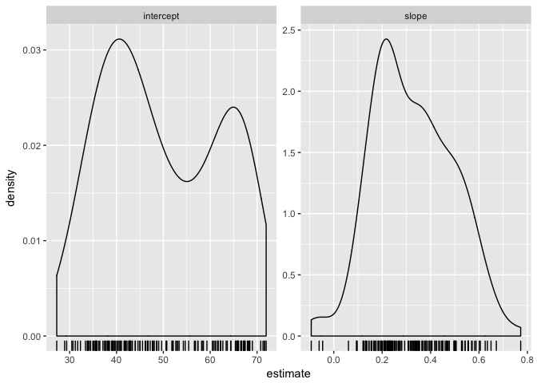
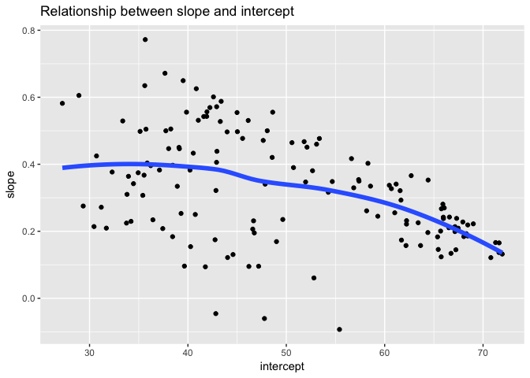

hw06 data wrangling
================
Lisa Wei
2017-11-04

First, I will load the relevant packages to do this assignment.

``` r
library(gapminder)
library(singer)
library(ggplot2)
suppressPackageStartupMessages(library(dplyr))
library(ggmap)
library(repurrrsive)
library(listviewer)
library(jsonlite)
library(dplyr)
library(tibble)
library(purrr)
```

    ## 
    ## Attaching package: 'purrr'

    ## The following object is masked from 'package:jsonlite':
    ## 
    ##     flatten

``` r
library(tidyr)
library(broom)
```

Task 2: Writing Functions
-------------------------

I will write a function to fit a quadratic model to the data (gdpPercap as a function of year). The form of the fit is `y=a*x + b*x^2`, where `a` and `b` are the coefficients.

``` r
## fit a quadratic model to the data (gdpPercap as a function of year)
## model for 1 country
quadratic.model <- function(dat, offset = 1952) {
  the_fit <- lm(gdpPercap ~ I(year - offset) + I((year - offset)^2), dat)
  setNames(coef(the_fit), c("intercept", "coef1", "coef2"))
}
```

Next, I will test out the function on just 1 country. The output would give the intercept, and the two coefficients.

``` r
## test on 1 country
quadratic.model(gapminder %>% filter(country == "Canada"))
```

    ##    intercept        coef1        coef2 
    ## 10877.450839   345.652815     1.923646

Then, I will modify the function to generate quadratic fits for all countries. The output will be a data frame showing the country, continent, intercept, coefficient 1 and coefficent 2.

``` r
## do for all countries
quadratic.model.all <- function(dat, offset = 1952) {
  the_fit <- lm(gdpPercap ~ I(year - offset) + I((year - offset)^2), dat)
  setNames(data.frame(t(coef(the_fit))), c("intercept", "coef1", "coef2"))
}

gfits_me <- gapminder %>%
  group_by(country, continent) %>% 
  do(quadratic.model.all(.))

gfits_me
```

    ## # A tibble: 142 x 5
    ## # Groups:   country, continent [142]
    ##        country continent  intercept      coef1       coef2
    ##         <fctr>    <fctr>      <dbl>      <dbl>       <dbl>
    ##  1 Afghanistan      Asia   830.6885  -2.348318  0.03468604
    ##  2     Albania    Europe  1936.9359  32.958467  0.39089918
    ##  3     Algeria    Africa  2165.0924 123.465726 -1.07608592
    ##  4      Angola    Africa  4518.9533 -55.943981  0.59440952
    ##  5   Argentina  Americas  6273.8961 122.132089 -0.64218954
    ##  6   Australia   Oceania 10238.8161 187.254193  4.35632179
    ##  7     Austria    Europe  6172.1838 479.251583  1.00583143
    ##  8     Bahrain      Asia 10844.2954 225.144088  0.98836946
    ##  9  Bangladesh      Asia   745.6704 -15.531985  0.47337677
    ## 10     Belgium    Europe  7863.6079 377.567611  1.56905062
    ## # ... with 132 more rows

Task 6: Work with a nested data frame
-------------------------------------

Step 1: Nest the data

``` r
(gap_nested <- gapminder %>% 
   group_by(continent, country) %>% 
   nest())
```

    ## # A tibble: 142 x 3
    ##    continent     country              data
    ##       <fctr>      <fctr>            <list>
    ##  1      Asia Afghanistan <tibble [12 x 4]>
    ##  2    Europe     Albania <tibble [12 x 4]>
    ##  3    Africa     Algeria <tibble [12 x 4]>
    ##  4    Africa      Angola <tibble [12 x 4]>
    ##  5  Americas   Argentina <tibble [12 x 4]>
    ##  6   Oceania   Australia <tibble [12 x 4]>
    ##  7    Europe     Austria <tibble [12 x 4]>
    ##  8      Asia     Bahrain <tibble [12 x 4]>
    ##  9      Asia  Bangladesh <tibble [12 x 4]>
    ## 10    Europe     Belgium <tibble [12 x 4]>
    ## # ... with 132 more rows

``` r
### I will perform some inspections as to what the nested data look like
gap_nested[[1, "data"]]
```

    ## # A tibble: 12 x 4
    ##     year lifeExp      pop gdpPercap
    ##    <int>   <dbl>    <int>     <dbl>
    ##  1  1952  28.801  8425333  779.4453
    ##  2  1957  30.332  9240934  820.8530
    ##  3  1962  31.997 10267083  853.1007
    ##  4  1967  34.020 11537966  836.1971
    ##  5  1972  36.088 13079460  739.9811
    ##  6  1977  38.438 14880372  786.1134
    ##  7  1982  39.854 12881816  978.0114
    ##  8  1987  40.822 13867957  852.3959
    ##  9  1992  41.674 16317921  649.3414
    ## 10  1997  41.763 22227415  635.3414
    ## 11  2002  42.129 25268405  726.7341
    ## 12  2007  43.828 31889923  974.5803

Step 2: I will fit a linear model to the data from each country. But let's try to fit the linear model to one country, Afghanistan, first to see the output.

``` r
### fit a model to data from Afghanistan
(fit <- lm(lifeExp ~ I(year - 1950), data = gap_nested[[1, "data"]]))
```

    ## 
    ## Call:
    ## lm(formula = lifeExp ~ I(year - 1950), data = gap_nested[[1, 
    ##     "data"]])
    ## 
    ## Coefficients:
    ##    (Intercept)  I(year - 1950)  
    ##        29.3566          0.2753

Now I will write a function to generate linear model. THen, I will `map()` this function over the list of columns holding the nested data to generate the linear fit for all countries using the following steps:

1.  Scale this up to all countries. Then, we’ll use map() inside mutate(), meaning we store the models inside gap\_nested in another list-column.
2.  Simplify and combine.
3.  Look at the result of broom::tidy() for a single model.
4.  Simplify back to a normal tibble. We do this by retaining variables that are amenable to simplification and using unnest(), thus completing the circle.

``` r
le_vs_yr <- function(df) {
  lm(lifeExp ~ I(year - 1950), data = df)
}

### some inspection/previews to see that the function works properly.
le_vs_yr(gap_nested[[1, "data"]])
```

    ## 
    ## Call:
    ## lm(formula = lifeExp ~ I(year - 1950), data = df)
    ## 
    ## Coefficients:
    ##    (Intercept)  I(year - 1950)  
    ##        29.3566          0.2753

``` r
### Use map() to apply the fitting function le_vs_yr() to the first two elements of gap_nested$data
fits <- map(gap_nested$data[1:2], le_vs_yr)
fits
```

    ## [[1]]
    ## 
    ## Call:
    ## lm(formula = lifeExp ~ I(year - 1950), data = df)
    ## 
    ## Coefficients:
    ##    (Intercept)  I(year - 1950)  
    ##        29.3566          0.2753  
    ## 
    ## 
    ## [[2]]
    ## 
    ## Call:
    ## lm(formula = lifeExp ~ I(year - 1950), data = df)
    ## 
    ## Coefficients:
    ##    (Intercept)  I(year - 1950)  
    ##        58.5598          0.3347

``` r
gap_coefs <- gap_nested %>% 
  mutate(fit = map(data, le_vs_yr),
         tidy = map(fit, tidy)) %>% 
  select(continent, country, tidy) %>% 
  unnest(tidy)
```

Step 4: Explore the estimated slopes and intercepts a bit.

Now that we have generated the linear model fit to each country, we can create some plots to explore the distributions of the slopes and intercepts.

``` r
(gap_coefs <- gap_coefs %>%
   mutate(term = recode(term,
                        `(Intercept)` = "intercept",
                        `I(year - 1950)` = "slope")))
```

    ## # A tibble: 284 x 7
    ##    continent     country      term   estimate   std.error  statistic
    ##       <fctr>      <fctr>     <chr>      <dbl>       <dbl>      <dbl>
    ##  1      Asia Afghanistan intercept 29.3566375 0.698981278  41.999176
    ##  2      Asia Afghanistan     slope  0.2753287 0.020450934  13.462890
    ##  3    Europe     Albania intercept 58.5597618 1.133575812  51.659325
    ##  4    Europe     Albania     slope  0.3346832 0.033166387  10.091036
    ##  5    Africa     Algeria intercept 42.2364149 0.756269040  55.848399
    ##  6    Africa     Algeria     slope  0.5692797 0.022127070  25.727749
    ##  7    Africa      Angola intercept 31.7079741 0.804287463  39.423683
    ##  8    Africa      Angola     slope  0.2093399 0.023532003   8.895964
    ##  9  Americas   Argentina intercept 62.2250191 0.167091314 372.401279
    ## 10  Americas   Argentina     slope  0.2317084 0.004888791  47.395847
    ## # ... with 274 more rows, and 1 more variables: p.value <dbl>

``` r
### A reshaped version of the estimates, gap_ests, is handy for numerical summarization and visualization.
(gap_ests <- gap_coefs %>% 
   select(continent:estimate) %>% 
   spread(key = term, value = estimate))
```

    ## # A tibble: 142 x 4
    ##    continent                  country intercept      slope
    ##  *    <fctr>                   <fctr>     <dbl>      <dbl>
    ##  1    Africa                  Algeria  42.23641 0.56927972
    ##  2    Africa                   Angola  31.70797 0.20933986
    ##  3    Africa                    Benin  38.92005 0.33423287
    ##  4    Africa                 Botswana  52.80778 0.06066853
    ##  5    Africa             Burkina Faso  33.95674 0.36397483
    ##  6    Africa                  Burundi  40.27037 0.15413427
    ##  7    Africa                 Cameroon  40.74917 0.25014685
    ##  8    Africa Central African Republic  38.44170 0.18390559
    ##  9    Africa                     Chad  39.30288 0.25324406
    ## 10    Africa                  Comoros  39.09522 0.45039091
    ## # ... with 132 more rows

``` r
gap_ests %>% 
  select(intercept, slope) %>% 
  summary()
```

    ##    intercept         slope         
    ##  Min.   :27.24   Min.   :-0.09302  
    ##  1st Qu.:39.36   1st Qu.: 0.20832  
    ##  Median :47.42   Median : 0.32145  
    ##  Mean   :49.86   Mean   : 0.32590  
    ##  3rd Qu.:62.05   3rd Qu.: 0.44948  
    ##  Max.   :71.95   Max.   : 0.77218

``` r
## look at distributions
ggplot(gap_coefs, aes(x = estimate)) +
  geom_density() + geom_rug() + facet_wrap(~ term, scales = "free")
```



``` r
ggplot(gap_ests, aes(x = intercept, y = slope)) +
  geom_point() +
  geom_smooth(se = FALSE, lwd = 2) +
  ggtitle("Relationship between slope and intercept")
```

    ## `geom_smooth()` using method = 'loess'



Issues I ran into and how I solved them
=======================================

Task 4:
-------

When writing the formula for the linear model, be sure to type `I((year - offset)^2)` and NOT `I(year - offset)^2`, which does not actually square the second term in the linear model fit.

Task 6:
-------

I was not very comfortable using `map()`, let alone using it to map functions over a nested data frame. Therefore, to help me get started, I pretty much followed step by step Jenny Bryan's tutorial on mapping a linear fit function over a nested data frame: <http://stat545.com/block024_group-nest-split-map.html>
