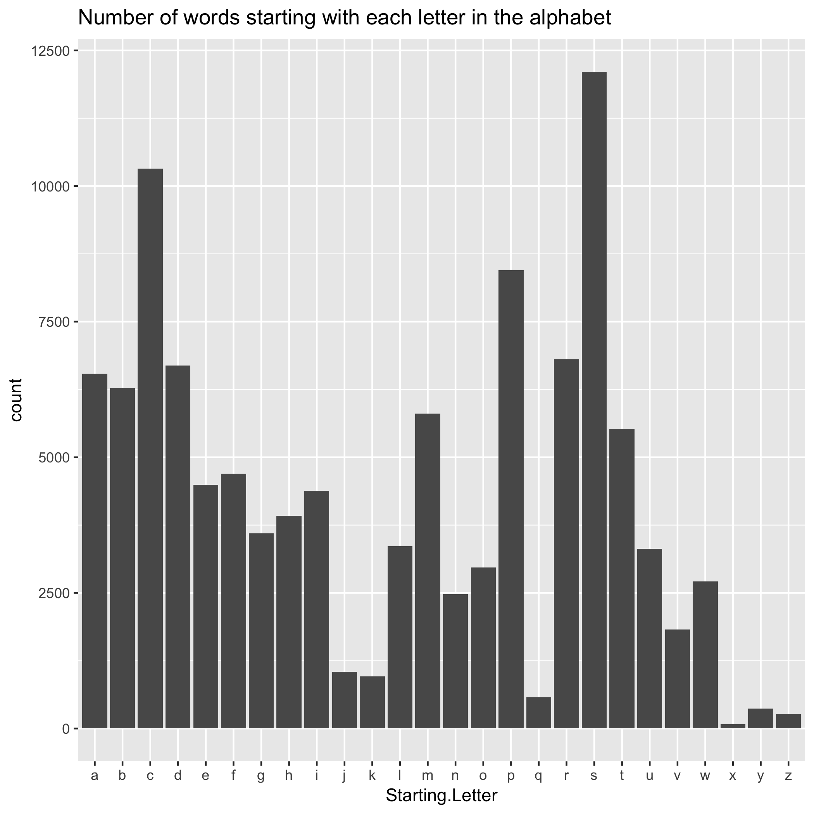

```{r setup, warning=FALSE}
library(readr)
library(ggplot2)
library(readr)
library(tidyverse)
args <- commandArgs(TRUE)
```


Step 1: Dwonloading and writing to data frame the orginal data showing all the english words

Source: http://www-01.sil.org/linguistics/wordlists/english/wordlist/wordsEn.txt


```{r en_words, warning=FALSE}
knitr::opts_chunk$set(echo=TRUE)
```


The table below shows the first 100 words

```{r table_words, warning=FALSE}
en_words <- read_tsv(args[1], col_names="Words")
knitr::kable(head(en_words, n=100))
```


Step 2: Lengths of each words were calculated. Then, the number of words that started with each letter in the alphabet was counted.

```{r en_words_length, warning=FALSE}
word_length <- data.frame(apply(en_words, 1, nchar)); colnames(word_length) <- c("Length"); rownames(word_length) <- NULL

en_words$start <- data.frame(do.call('rbind', strsplit(en_words$Words,'',fixed=TRUE)))[,1]
word_starts <- en_words %>% group_by(start) %>% count()

```


Below is the word lengths of the first 100 words

```{r table_length, warning=FALSE}
knitr::kable(head(word_length, n=100))

# word_length was also written to a text file as shown below
# en <- read_tsv("words_length.txt", col_names="Length")
```

Below is the number of words that starts with each letter of the alphabet.

```{r table_starts, warning=FALSE}
knitr::kable(word_starts)

```

Step 3: Drawing graphs - a histogram of the distribution of the lengths of the English words and a bar graph showing the number of words that started with each letter in the alphabet.


What we notice in the graph below is that words that start with "d" and "s" are the greatest in number.




