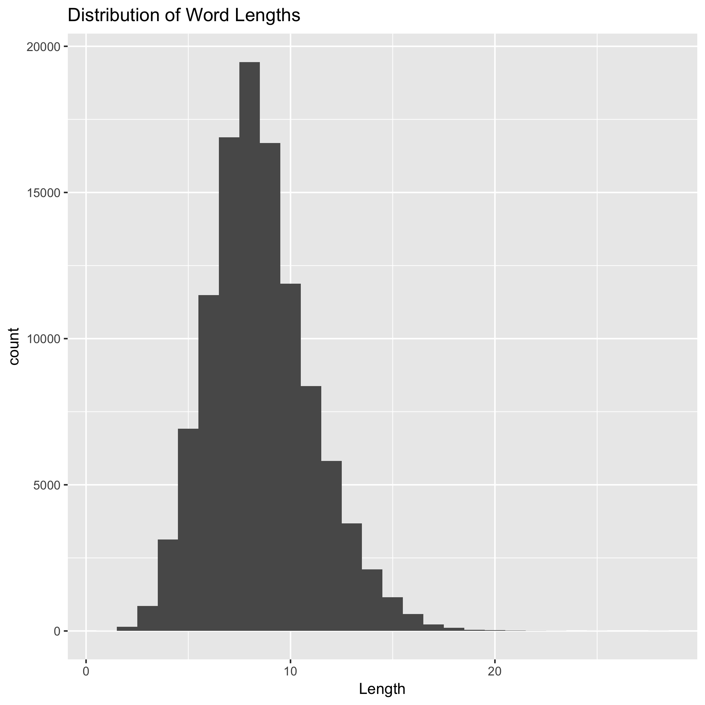

```{r setup, warning=FALSE}
library(readr)
library(ggplot2)
library(readr)
library(tidyverse)
args <- commandArgs(TRUE)
```


Step 1: Dwonloading and writing to data frame the orginal data showing all the english words

Source: http://www-01.sil.org/linguistics/wordlists/english/wordlist/wordsEn.txt


```{r en_words, warning=FALSE}
knitr::opts_chunk$set(echo=TRUE)

en_words <- read_tsv(args[1], col_names="Words")
knitr::kable(en_words)

```


Step 2: Lengths of each words was calculated

```{r en_words_length, warning=FALSE}
word_length <- data.frame(apply(en_words, 1, nchar));
knitr::kable(word_length)

# word_length was also written to a text file as shown below
# en <- read_tsv("words_length.txt", col_names="Length")
```

Step 3: Drawing a graph - a histogram of the distribution of the lengths of the English words.




