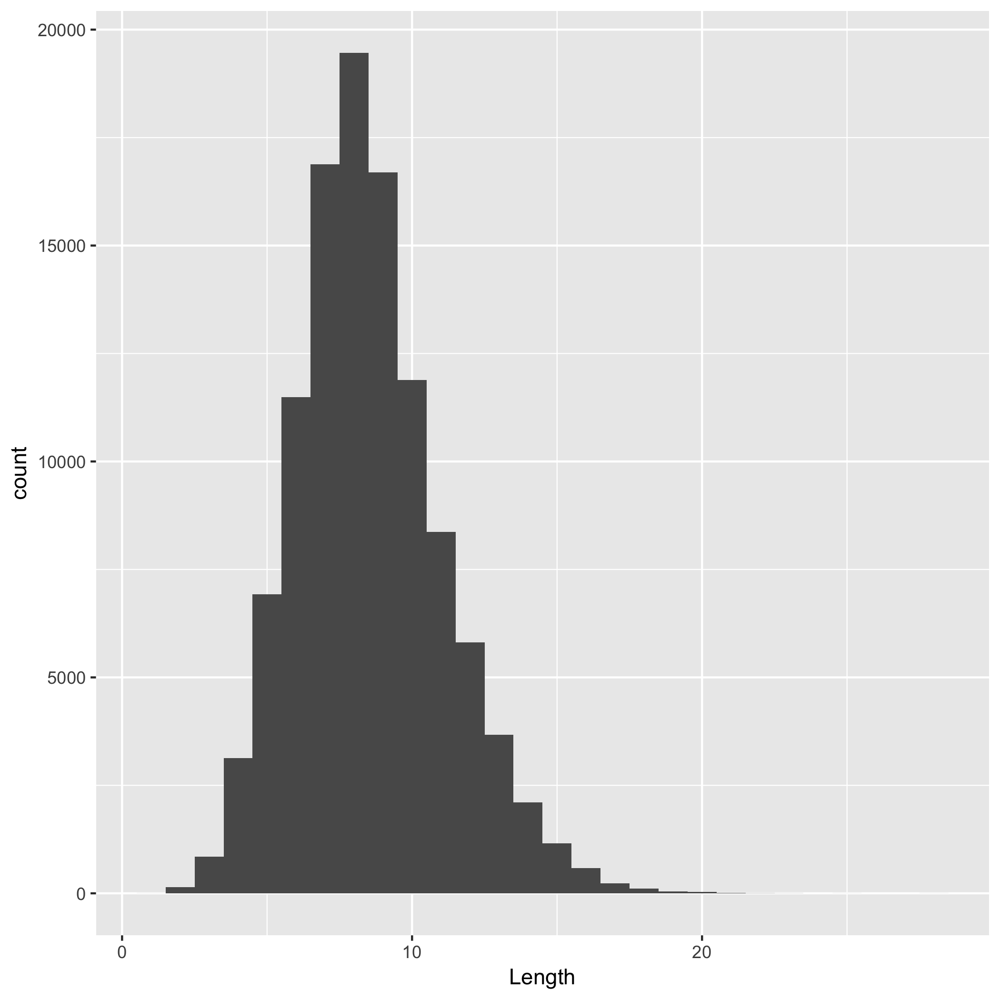

hw07\_make
================
Lisa Wei
2017-11-12

``` r
library(readr)
library(ggplot2)
library(readr)
library(tidyverse)
```

    ## Loading tidyverse: tibble
    ## Loading tidyverse: tidyr
    ## Loading tidyverse: purrr
    ## Loading tidyverse: dplyr

    ## Conflicts with tidy packages ----------------------------------------------

    ## filter(): dplyr, stats
    ## lag():    dplyr, stats

``` r
args <- commandArgs(TRUE)
```

Step 1: Dwonloading and writing to data frame the orginal data showing all the english words

Source: <http://www-01.sil.org/linguistics/wordlists/english/wordlist/wordsEn.txt>

``` r
knitr::opts_chunk$set(echo=TRUE)

en_words <- read_tsv(args[1], col_names="Words")
```

    ## Parsed with column specification:
    ## cols(
    ##   Words = col_character()
    ## )

``` r
head(en_words)
```

    ## # A tibble: 6 x 1
    ##      Words
    ##      <chr>
    ## 1        a
    ## 2      aah
    ## 3    aahed
    ## 4   aahing
    ## 5     aahs
    ## 6 aardvark

Step 2: Lengths of each words was calculated

``` r
word_length <- data.frame(apply(en_words, 1, nchar));
head(word_length)
```

    ##   apply.en_words..1..nchar.
    ## 1                         1
    ## 2                         3
    ## 3                         5
    ## 4                         6
    ## 5                         4
    ## 6                         8

``` r
# word_length was also written to a text file as shown below
# en <- read_tsv("words_length.txt", col_names="Length")
```

Step 3: Drawing a graph - a histogram of the distribution of the lengths of the English words.


